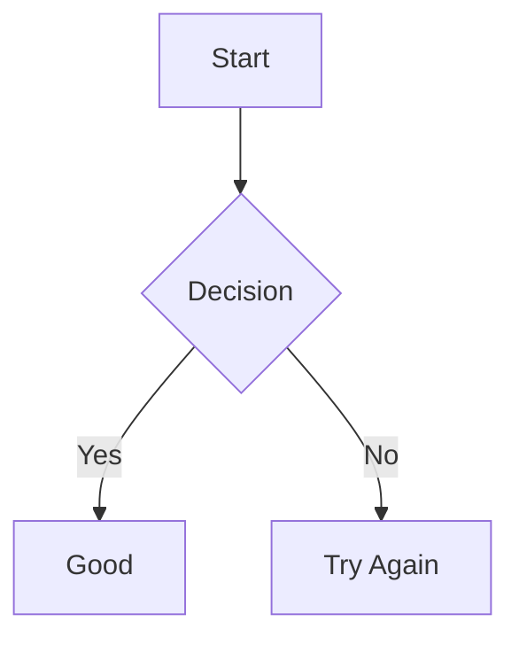

---
{"dg-publish":true,"permalink":"/education/obsidian-tutorial/basic-en/","title":"Obsidian basics","noteIcon":"global/original_logo.svg","created":"2025-11-25T18:04:33.314+05:00","updated":"2025-12-24T17:54:02.121+05:00"}
---


# Obsidian Beginner’s Guide (English) – Clean & Visual

# Index

[[EDUCATION/Obsidian tutorial/Basic.en#001. Install Obsidian in 1 Minute\|001. Install Obsidian in 1 Minute]]
[[EDUCATION/Obsidian tutorial/Basic.en#002. Switch to Uzbek Language Fast\|002. Switch to Uzbek Language Fast]]
[[EDUCATION/Obsidian tutorial/Basic.en#003. Create New Note in One Click\|003. Create New Note in One Click]]
[[EDUCATION/Obsidian tutorial/Basic.en#004. Headings with Hash Levels\|004. Headings with Hash Levels]]
[[EDUCATION/Obsidian tutorial/Basic.en#005. How to Make Text Bold in Obsidian\|005. How to Make Text Bold in Obsidian]]
[[EDUCATION/Obsidian tutorial/Basic.en#006. How to Write Italic Text Fast\|006. How to Write Italic Text Fast]]
[[EDUCATION/Obsidian tutorial/Basic.en#007. Strikethrough Text Tutorial\|007. Strikethrough Text Tutorial]]
[[EDUCATION/Obsidian tutorial/Basic.en#008. Highlight Important Text Easily\|008. Highlight Important Text Easily]]
[[EDUCATION/Obsidian tutorial/Basic.en#009. Toolbar Quick Formatting Tips\|009. Toolbar Quick Formatting Tips]]
[[EDUCATION/Obsidian tutorial/Basic.en#010. Horizontal Divider Line in Obsidian\|010. Horizontal Divider Line in Obsidian]]
[[EDUCATION/Obsidian tutorial/Basic.en#011. Block Quotes for Better Notes\|011. Block Quotes for Better Notes]]
[[EDUCATION/Obsidian tutorial/Basic.en#012. Bulleted Lists in Obsidian\|012. Bulleted Lists in Obsidian]]
[[EDUCATION/Obsidian tutorial/Basic.en#013. Numbered Lists Step by Step\|013. Numbered Lists Step by Step]]
[[EDUCATION/Obsidian tutorial/Basic.en#014. Indent and Outdent Lists\|014. Indent and Outdent Lists]]
[[EDUCATION/Obsidian tutorial/Basic.en#015. Task Checkboxes in Obsidian\|015. Task Checkboxes in Obsidian]]
[[EDUCATION/Obsidian tutorial/Basic.en#016. Add External Links Correctly\|016. Add External Links Correctly]]
[[EDUCATION/Obsidian tutorial/Basic.en#017. Simple Internal Links Wiki Style\|017. Simple Internal Links Wiki Style]]
[[EDUCATION/Obsidian tutorial/Basic.en#018. Aliased Internal Links\|018. Aliased Internal Links]]
[[EDUCATION/Obsidian tutorial/Basic.en#019. Link to Headings Inside Note\|019. Link to Headings Inside Note]]
[[EDUCATION/Obsidian tutorial/Basic.en#020. Embed Notes with Exclamation\|020. Embed Notes with Exclamation]]
[[EDUCATION/Obsidian tutorial/Basic.en#021. Code Blocks and Syntax Highlight\|021. Code Blocks and Syntax Highlight]]
[[EDUCATION/Obsidian tutorial/Basic.en#022. Create Tables in Obsidian Fast\|022. Create Tables in Obsidian Fast]]
[[EDUCATION/Obsidian tutorial/Basic.en#023. Assets Folder Setup\|023. Assets Folder Setup]]
[[EDUCATION/Obsidian tutorial/Basic.en#024. Embed Audio Files in Notes\|024. Embed Audio Files in Notes]]
[[EDUCATION/Obsidian tutorial/Basic.en#025. Embed Local Video Files Easily\|025. Embed Local Video Files Easily]]
[[EDUCATION/Obsidian tutorial/Basic.en#026. Embed PDF Documents in Obsidian\|026. Embed PDF Documents in Obsidian]]
[[EDUCATION/Obsidian tutorial/Basic.en#027. Add and Embed Images Properly\|027. Add and Embed Images Properly]]
[[EDUCATION/Obsidian tutorial/Basic.en#028. Embed Maps\|028. Embed Maps]]
[[EDUCATION/Obsidian tutorial/Basic.en#029. Callouts for Beautiful Notes\|029. Callouts for Beautiful Notes]]
[[EDUCATION/Obsidian tutorial/Basic.en#030. Flowcharts and Diagrams Fast (Mermaid)\|030. Flowcharts and Diagrams (Mermaid)]]
[[EDUCATION/Obsidian tutorial/Basic.en#031. Math in Obsidian (LaTeX)\|031. Math in Obsidian (LaTeX)]]

> [!warning] Reminder:
>
> ##### Below syntax examples are given. Some of them should be wrapped with two <b>```</b> backticks when using. They are marked as #InsideTripleBacktics in examples.

---

# 001. Install Obsidian in 1 Minute

###### [[EDUCATION/Obsidian tutorial/Basic.en#Index\|Jump to Index]]

<video autoplay muted controls allowfullscreen preload="none" src="https://raw.githubusercontent.com/fargonee/obsidian_tutorial/main/resources/sounded_videos/001_yangi_hamyon_ochish___62ce7908763d16742d92294e7be78ee2f12e969b388fb78234ec37b148731944.mkv"/>

1. Go to [obsidian.md](https://obsidian.md)
2. Download the installer for your OS (Windows/Mac/Linux)
3. Run the installer → Follow prompts
4. Launch Obsidian → Done! It's free and open-source.

---

# 002. Switch to Uzbek Language Fast

###### [[EDUCATION/Obsidian tutorial/Basic.en#Index\|Jump to Index]]

<video autoplay muted controls allowfullscreen preload="none" src="https://raw.githubusercontent.com/fargonee/obsidian_tutorial/main/resources/sounded_videos/002_ozbek_tiliga_sozlash___8c7e1b6775a0091c31a740e19164f1b20c1abfdc7043b999f82013c5b4220e24.mkv"/>

1. Settings → Appearance → Language
2. Select “Uzbek (Ўзбек)”
3. Restart the app → Everything switches to Uzbek.

---

# 003. Create New Note in One Click

###### [[EDUCATION/Obsidian tutorial/Basic.en#Index\|Jump to Index]]

<video autoplay muted controls allowfullscreen preload="none" src="https://raw.githubusercontent.com/fargonee/obsidian_tutorial/main/resources/sounded_videos/003_yangi_eslatma_yaratish___10d75ec88b5e8d0ab031016491e24e7b24ab6a4f7dd0d1083027555eed20b4b0.mkv"/>

1. Press Ctrl + N → New blank note
2. Or click “+” in the left sidebar
3. Name the file right away (supports Latin or Cyrillic).

---

# 004. Headings with Hash Levels

###### [[EDUCATION/Obsidian tutorial/Basic.en#Index\|Jump to Index]]

<video autoplay muted controls allowfullscreen preload="none" src="https://raw.githubusercontent.com/fargonee/obsidian_tutorial/main/resources/sounded_videos/004_sarvlavhalar___6b3ae0127bf621a3253131631386da3d3083fdbccf295138afa6da87e68850be.mkv"/>

- [ ] _Syntax_:

```code
# H1 Heading (Biggest)
## H2 Heading
### H3 Heading
#### H4 Heading
##### H5 Heading
###### H6 Heading (smallest)
```

- [x] _Result_:

# H1 Heading (Biggest)

## H2 Heading

### H3 Heading

#### H4 Heading

##### H5 Heading

###### H6 Heading (smallest)

---

# 005. How to Make Text Bold in Obsidian

###### [[EDUCATION/Obsidian tutorial/Basic.en#Index\|Jump to Index]]

<video autoplay muted controls allowfullscreen preload="none" src="https://raw.githubusercontent.com/fargonee/obsidian_tutorial/main/resources/sounded_videos/005_qalin_matn___4f85e0e68709ae50d6b99bed8901ffa783898608792aaa799064c4dd05d0e3e8.mkv"/>

- [ ] _Syntax_:

```code
**bold** or __bold__
```

- [x] _Result_:
      **bold** or **bold**

---

# 006. How to Write Italic Text Fast

###### [[EDUCATION/Obsidian tutorial/Basic.en#Index\|Jump to Index]]

<video autoplay muted controls allowfullscreen preload="none" src="https://raw.githubusercontent.com/fargonee/obsidian_tutorial/main/resources/sounded_videos/006_qiya_matn___c7aea5a314c3f6333335afcd1c7fa8192cd2e56d44324f5701ac619b73566330.mkv"/>

- [ ] _Syntax_:

```code
*italic* or _italic_
```

- [x] _Result_:
      _italic_ or _italic_

---

# 007. Strikethrough Text Tutorial

###### [[EDUCATION/Obsidian tutorial/Basic.en#Index\|Jump to Index]]

<video autoplay muted controls allowfullscreen preload="none" src="https://raw.githubusercontent.com/fargonee/obsidian_tutorial/main/resources/sounded_videos/007_ustiga_chizilgan_matn___50ddf3f3525f4f668478cccb98663c70d704abada3a290c9779d63e9276d0097.mkv"/>

- [ ] _Syntax_:

```code
~~strikethrough~~
```

- [x] _Result_:
      ~~strikethrough~~

---

# 008. Highlight Important Text Easily

###### [[EDUCATION/Obsidian tutorial/Basic.en#Index\|Jump to Index]]

<video autoplay muted controls allowfullscreen preload="none" src="https://raw.githubusercontent.com/fargonee/obsidian_tutorial/main/resources/sounded_videos/008_belgilangan_matn___59e6c2c6175a9f988e27ac14402fa6395aee5b1186c82b73a01074175e0b4354.mkv"/>

- [ ] _Syntax_:

```code
==highlight==
```

- [x] _Result_:

---

# 009. Toolbar Quick Formatting Tips

###### [[EDUCATION/Obsidian tutorial/Basic.en#Index\|Jump to Index]]

<video autoplay muted controls allowfullscreen preload="none" src="https://raw.githubusercontent.com/fargonee/obsidian_tutorial/main/resources/sounded_videos/009_matn_formatlash_oson_usuli___96f954cccab714212d460e16d4115c1dfea57bc62793be471976ceacfad8f8eb.mkv"/>

Select text → use:

- `Ctrl+B` → **bold**
- `Ctrl+I` → _italic_
- `Ctrl+D` → ~~strikethrough~~
- `Alt+H` → ==highlight==

---

# 010. Horizontal Divider Line in Obsidian

###### [[EDUCATION/Obsidian tutorial/Basic.en#Index\|Jump to Index]]

<video autoplay muted controls allowfullscreen preload="none" src="https://raw.githubusercontent.com/fargonee/obsidian_tutorial/main/resources/sounded_videos/010_gorizontal_chiziq___f6741c79fbcbd0ee61ea5e99e608d5bff534a3fabc38252acf1bbda7947a3b8f.mkv"/>

- [ ] _Syntax_:

```code
---
***
___
```

- [x] _Result_:

---

---

---

---

# 011. Block Quotes for Better Notes

###### [[EDUCATION/Obsidian tutorial/Basic.en#Index\|Jump to Index]]

<video autoplay muted controls allowfullscreen preload="none" src="https://raw.githubusercontent.com/fargonee/obsidian_tutorial/main/resources/sounded_videos/011_blokli_iqtibos___74636df7221ba08e3b0303ba85c90a0b88904309b2dd7d8704fc7dd9e8f71a8f.mkv"/>

- [ ] _Syntax_:

```code
> Single level quote
>> Nested quote
```

- [x] _Result_:

> Single level quote
>
> > Nested quote

---

# 012. Bulleted Lists in Obsidian

###### [[EDUCATION/Obsidian tutorial/Basic.en#Index\|Jump to Index]]

<video autoplay muted controls allowfullscreen preload="none" src="https://raw.githubusercontent.com/fargonee/obsidian_tutorial/main/resources/sounded_videos/012_tartiblanMagan_royxat___59b6ace492f886c329f18631fd63c86232100631c736bcf629cfd1f4b6243d1c.mkv"/>

- [ ] _Syntax_:

```code
- Item 1
- Item 2
  - Sub-item
```

- [x] _Result_:
- Item 1
- Item 2
  - Sub-item

---

# 013. Numbered Lists Step by Step

###### [[EDUCATION/Obsidian tutorial/Basic.en#Index\|Jump to Index]]

<video autoplay muted controls allowfullscreen preload="none" src="https://raw.githubusercontent.com/fargonee/obsidian_tutorial/main/resources/sounded_videos/013_tartiblangan_royxat___dd1479c1b049f341f7b7fe1442bfb8f2daedf2a9e845597f8d991b0047cee4b6.mkv"/>

- [ ] _Syntax_:

```code
1. First
2. Second
   3. Sub 1
   4. Sub 2
```

- [x] _Result_:

1. First
2. Second 3. Sub 1 4. Sub 2

---

# 014. Indent and Outdent Lists

###### [[EDUCATION/Obsidian tutorial/Basic.en#Index\|Jump to Index]]

<video autoplay muted controls allowfullscreen preload="none" src="https://raw.githubusercontent.com/fargonee/obsidian_tutorial/main/resources/sounded_videos/014_royxat_elementlari_sathini_ozgartirish___c80be343ae7a2b9257d4a617a3f3960c2f639abf5524ac09a23ea95622f45136.mkv"/>

#### `Tab` → indent  

#### `Shift+Tab` → outdent

---

# 015. Task Checkboxes in Obsidian

###### [[EDUCATION/Obsidian tutorial/Basic.en#Index\|Jump to Index]]

<video autoplay muted controls allowfullscreen preload="none" src="https://raw.githubusercontent.com/fargonee/obsidian_tutorial/main/resources/sounded_videos/015_checkbox_lar___1ce21d6e4804d412f0593ecec9c463ea8db4271f3fe42a3c88e7842f51e188e9.mkv"/>

- [ ] _Syntax_:

```code
- [ ] Not done
- [x] Done
- [>] Deferred
- [?] Question
```

- [x] _Result_:

- [ ] Not done
- [x] Done
- [>] Deferred
- [?] Question

---

# 016. Add External Links Correctly

###### [[EDUCATION/Obsidian tutorial/Basic.en#Index\|Jump to Index]]

<video autoplay muted controls allowfullscreen preload="none" src="https://raw.githubusercontent.com/fargonee/obsidian_tutorial/main/resources/sounded_videos/016_tashqi_linklar___04b42c846cb299bdcb45330d03277d022464e6501b9e7b92ec65678f38c0c279.mkv"/>

- [ ] _Syntax_:

```code
[Obsidian](https://obsidian.md)
```

- [x] _Result_: → [Obsidian](https://obsidian.md)

---

# 017. Simple Internal Links Wiki Style

###### [[EDUCATION/Obsidian tutorial/Basic.en#Index\|Jump to Index]]

<video autoplay muted controls allowfullscreen preload="none" src="https://raw.githubusercontent.com/fargonee/obsidian_tutorial/main/resources/sounded_videos/017_ichki_linklar_oddiy_link___53cbc2f77b6e972c66a2e6fcf71c99f4b45da45d3078d8950af2ec4adfa3d2e4.mkv"/>

- [ ] _Syntax_:

```code
\[\[031. Math in Obsidian\]\]
```

- [x] _Result_: → [[031. Math in Obsidian\|031. Math in Obsidian]]

---

# 018. Aliased Internal Links

###### [[EDUCATION/Obsidian tutorial/Basic.en#Index\|Jump to Index]]

<video autoplay muted controls allowfullscreen preload="none" src="https://raw.githubusercontent.com/fargonee/obsidian_tutorial/main/resources/sounded_videos/018_ichki_linklar_nomlangan_link___9a8500bda856cd386e1ed65dff7a87cad5f552dec9989a61715b51357f5528ab.mkv"/>

- [ ] _Syntax_:

```code
\[\[031. Math in Obsidian|LaTeX Guide\]\]
```

- [x] _Result_: → [LaTeX Guide]([[031. Math in Obsidian\|031. Math in Obsidian]])

---

# 019. Link to Headings Inside Note

###### [[EDUCATION/Obsidian tutorial/Basic.en#Index\|Jump to Index]]

<video autoplay muted controls allowfullscreen preload="none" src="https://raw.githubusercontent.com/fargonee/obsidian_tutorial/main/resources/sounded_videos/019_ichki_linklar_sarvlavha_linklari___b29dcd2cc6051b2b3a43880efe32cd87ae5180b43fafa9154029dfffdb72c4e0.mkv"/>

- [ ] _Syntax_:

```code
\[\[Obsidian Guide#005. How to Make Text Bold in Obsidian|Bold Text\]\]
```

- [x] _Result_: → [Bold Text]([[Obsidian Guide#005. How to Make Text Bold in Obsidian\|Obsidian Guide#005. How to Make Text Bold in Obsidian]])

---

# 020. Embed Notes with Exclamation

###### [[EDUCATION/Obsidian tutorial/Basic.en#Index\|Jump to Index]]

<video autoplay muted controls allowfullscreen preload="none" src="https://raw.githubusercontent.com/fargonee/obsidian_tutorial/main/resources/sounded_videos/020_eslatmalarni_biriktirish___5b3123c4b27659c8f113943a44ff444ebe5fb592c0f7fbd59722fd4d62209a6c.mkv"/>

- [ ] _Syntax_:

```code
!\[\[001. Install Obsidian in 1 Minute\]\]
```

- [x] _Result_: → (embeds the whole note here)

Resize example:

```code
!\[\[photo.jpg|300\]\]
```

---

# 021. Code Blocks and Syntax Highlight

###### [[EDUCATION/Obsidian tutorial/Basic.en#Index\|Jump to Index]]

<video autoplay muted controls allowfullscreen preload="none" src="https://raw.githubusercontent.com/fargonee/obsidian_tutorial/main/resources/sounded_videos/021_kod_bloklari___40c00d056d3d09fe8023b3022805ac8d753f4f2d61963c5a73e5a9bc5b7d313d.mkv"/>

- [ ] _Syntax_:
  ```markdown
  python
  print("Hello Obsidian!")
  ```
- [x] _Result_:

```python
print("Hello Obsidian!")
```

---

# 022. Create Tables in Obsidian Fast

###### [[EDUCATION/Obsidian tutorial/Basic.en#Index\|Jump to Index]]

<video autoplay muted controls allowfullscreen preload="none" src="https://raw.githubusercontent.com/fargonee/obsidian_tutorial/main/resources/sounded_videos/022_jadvallar___dc1753675e585f73c5f5d59daf1da8bed59349ffc69346f64fffb4e0b29bf3de.mkv"/>

- [ ] _Syntax_:

```code
| Name   | Age | City       |
|:-------|:---:|-----------:|
| Ali    | 25  | Tashkent   |
| Vali   | 30  | Samarkand  |
```

- [x] _Result_:

| Name | Age |      City |
| :--- | :-: | --------: |
| Ali  | 25  |  Tashkent |
| Vali | 30  | Samarkand |

---

# 023. Assets Folder Setup

###### [[EDUCATION/Obsidian tutorial/Basic.en#Index\|Jump to Index]]

<video autoplay muted controls allowfullscreen preload="none" src="https://raw.githubusercontent.com/fargonee/obsidian_tutorial/main/resources/sounded_videos/023_medialar_resurslarni_tayyorlash___20664f6660c4bb9e14549fb2148d3c16fc998471dd6e5953ae941bc523639981.mkv"/>

- [ ] _Syntax_:
      Create folder → `Assets` or `Attachments` → drop all media there.

---

# 024. Embed Audio Files in Notes

###### [[EDUCATION/Obsidian tutorial/Basic.en#Index\|Jump to Index]]

<video autoplay muted controls allowfullscreen preload="none" src="https://raw.githubusercontent.com/fargonee/obsidian_tutorial/main/resources/sounded_videos/024_medialar_musiqa_biriktirish___ea8edebe9e04e8962aaee78fb48f3508e8e26200cca89526d6234a0e3e366585.mkv"/>

- [ ] _Syntax_:

```code
!\[\[song.mp3\]\]
```

Plays inline.

- [x] _Result_:

---

# 025. Embed Local Video Files Easily

###### [[EDUCATION/Obsidian tutorial/Basic.en#Index\|Jump to Index]]

<video autoplay muted controls allowfullscreen preload="none" src="https://raw.githubusercontent.com/fargonee/obsidian_tutorial/main/resources/sounded_videos/025_medialar_video_biriktirish___f6b8172d82dfc1a548473449e545c2da225a8dce5facda49fcad17546a0d0bdf.mkv"/>

- [ ] _Syntax_:

##### markdown

```code
!\[\[video.mp4\]\]
```

##### html

```code
<video src="local_path_or_external_url_link" width="300" autoplay muted></video>
```

- [x] _Result_:
      <video src="assets/animated_1.mp4" width="300" autoplay muted></video>

---

# 026. Embed PDF Documents in Obsidian

###### [[EDUCATION/Obsidian tutorial/Basic.en#Index\|Jump to Index]]

<video autoplay muted controls allowfullscreen preload="none" src="https://raw.githubusercontent.com/fargonee/obsidian_tutorial/main/resources/sounded_videos/026_medialar_pdf_biriktirish___f122e6a7ba96faf9c47db147f2334094cb19457b630e61749eec87210645bceb.mkv"/>

- [ ] _Syntax_:

```code
!\[\[paper.pdf\]\]
!\[\[paper.pdf|200\]\]
!\[\[paper.pdf#page=5\]\]
```

Shows page 5 directly.

- [x] _Result_:
      ![[progit.pdf|200]]

---

# 027. Add and Embed Images Properly

###### [[EDUCATION/Obsidian tutorial/Basic.en#Index\|Jump to Index]]

<video autoplay muted controls allowfullscreen preload="none" src="https://raw.githubusercontent.com/fargonee/obsidian_tutorial/main/resources/sounded_videos/027_medialar_rasm_biriktirish___616f562592a6d637b9794cf390021eb2e54fdbc1b6ecbd14920023cdee6ed833.mkv"/>

- [ ] _Syntax_:
      !\[\[photo.jpg\]\]
      !\[\[photo.jpg|400x300\]\]
      !\[\[photo.jpg|right|250\]\]

Aligns right with width 250px.

- [x] _Result_:


---

# 028. Embed Maps

###### [[EDUCATION/Obsidian tutorial/Basic.en#Index\|Jump to Index]]

<video autoplay muted controls allowfullscreen preload="none" src="https://raw.githubusercontent.com/fargonee/obsidian_tutorial/main/resources/sounded_videos/028_medialar_xarita_biriktirish___57b64848cda9d0d17d4d4cb31797a98b4fedc98a5fdad77b4651ea94049dafbb.mkv"/>

- [ ] _Syntax_:

```code
<iframe width=600 height=600 src="the_url_of_a_map" />
```

- [x] _Result_:
<iframe width="425" height="350" src="https://www.opentmap.org/export/embed.html?bbox=71.52442932128908%2C40.2748109313747%2C71.97761535644533%2C40.51171103483292&amp;layer=mapnik" style="border: 1px solid black"></iframe>

---

# 029. Callouts for Beautiful Notes

###### [[EDUCATION/Obsidian tutorial/Basic.en#Index\|Jump to Index]]

<video autoplay muted controls allowfullscreen preload="none" src="https://raw.githubusercontent.com/fargonee/obsidian_tutorial/main/resources/sounded_videos/029_konvertlar___ec0e09799ef10b63c6c09c7e991f55e8c8a88b0f6ba90b52e18055788669fc10.mkv"/>

- [ ] _Syntax_:

```code
> [!info] Title
> Useful information
```

- [x] _Result_:

  > [!info] Title
  > Useful information

- [ ] _Syntax_:

```code
> [!tip] Quick Tip
> Save time with this!
```

- [x] _Result_:

  > [!tip] Quick Tip
  > Save time with this!

- [ ] _Syntax_:

```code
> [!warning] Careful
> This might break something
```

- [x] _Result_:
  > [!warning] Careful
  > This might break something

Other types: `note`, `abstract`, `success`, `error`, `example`, `quote`

---

# 030. Flowcharts and Diagrams (Mermaid)

###### [[EDUCATION/Obsidian tutorial/Basic.en#Index\|Jump to Index]]

<video autoplay muted controls allowfullscreen preload="none" src="https://raw.githubusercontent.com/fargonee/obsidian_tutorial/main/resources/sounded_videos/030_mermaid_diagrammalar___c4bcdc05bf8495846e68c993670178ae75152220d42a5d3382dfbf4b464a7b7e.mkv"/>

#InsideTripleBacktics

- [ ] _Syntax_:

```code
mermaid
graph TD
    A[Start] --> B{Decision}
    B -->|Yes| C[Good]
    B -->|No| D[Try Again]
```

- [x] _Result_:



---

# 031. Math in Obsidian (LaTeX)

###### [[Basic.en#Index|Jump to Index]]

<video autoplay muted controls allowfullscreen preload="none" src="https://raw.githubusercontent.com/fargonee/obsidian_tutorial/main/resources/sounded_videos/031_matematik_ifodalar_LaTeX_formati___40cb5637cc2248790aa2eae1a58306aecc74eab56f566cf5f4337187ca64198e.mkv"/>

### Inline:

- [ ] _Syntax_
      `$E = mc^2---
{"dg-publish":true,"permalink":"/education/obsidian-tutorial/basic-en/","title":"Obsidian basics","noteIcon":"global/original_logo.svg","created":"2025-11-25T18:04:33.314+05:00","updated":"2025-12-24T17:54:02.121+05:00"}
---


# Obsidian Beginner’s Guide (English) – Clean & Visual

# Index

[[Basic.en#001. Install Obsidian in 1 Minute|001. Install Obsidian in 1 Minute]]
[[Basic.en#002. Switch to Uzbek Language Fast|002. Switch to Uzbek Language Fast]]
[[Basic.en#003. Create New Note in One Click|003. Create New Note in One Click]]
[[Basic.en#004. Headings with Hash Levels|004. Headings with Hash Levels]]
[[Basic.en#005. How to Make Text Bold in Obsidian|005. How to Make Text Bold in Obsidian]]
[[Basic.en#006. How to Write Italic Text Fast|006. How to Write Italic Text Fast]]
[[Basic.en#007. Strikethrough Text Tutorial|007. Strikethrough Text Tutorial]]
[[Basic.en#008. Highlight Important Text Easily|008. Highlight Important Text Easily]]
[[Basic.en#009. Toolbar Quick Formatting Tips|009. Toolbar Quick Formatting Tips]]
[[Basic.en#010. Horizontal Divider Line in Obsidian|010. Horizontal Divider Line in Obsidian]]
[[Basic.en#011. Block Quotes for Better Notes|011. Block Quotes for Better Notes]]
[[Basic.en#012. Bulleted Lists in Obsidian|012. Bulleted Lists in Obsidian]]
[[Basic.en#013. Numbered Lists Step by Step|013. Numbered Lists Step by Step]]
[[Basic.en#014. Indent and Outdent Lists|014. Indent and Outdent Lists]]
[[Basic.en#015. Task Checkboxes in Obsidian|015. Task Checkboxes in Obsidian]]
[[Basic.en#016. Add External Links Correctly|016. Add External Links Correctly]]
[[Basic.en#017. Simple Internal Links Wiki Style|017. Simple Internal Links Wiki Style]]
[[Basic.en#018. Aliased Internal Links|018. Aliased Internal Links]]
[[Basic.en#019. Link to Headings Inside Note|019. Link to Headings Inside Note]]
[[Basic.en#020. Embed Notes with Exclamation|020. Embed Notes with Exclamation]]
[[Basic.en#021. Code Blocks and Syntax Highlight|021. Code Blocks and Syntax Highlight]]
[[Basic.en#022. Create Tables in Obsidian Fast|022. Create Tables in Obsidian Fast]]
[[Basic.en#023. Assets Folder Setup|023. Assets Folder Setup]]
[[Basic.en#024. Embed Audio Files in Notes|024. Embed Audio Files in Notes]]
[[Basic.en#025. Embed Local Video Files Easily|025. Embed Local Video Files Easily]]
[[Basic.en#026. Embed PDF Documents in Obsidian|026. Embed PDF Documents in Obsidian]]
[[Basic.en#027. Add and Embed Images Properly|027. Add and Embed Images Properly]]
[[Basic.en#028. Embed Maps|028. Embed Maps]]
[[Basic.en#029. Callouts for Beautiful Notes|029. Callouts for Beautiful Notes]]
[[Basic.en#030. Flowcharts and Diagrams Fast (Mermaid)|030. Flowcharts and Diagrams (Mermaid)]]
[[Basic.en#031. Math in Obsidian (LaTeX)|031. Math in Obsidian (LaTeX)]]

> [!warning] Reminder:
>
> ##### Below syntax examples are given. Some of them should be wrapped with two <b>```</b> backticks when using. They are marked as #InsideTripleBacktics in examples.

---

# 001. Install Obsidian in 1 Minute

###### [[Basic.en#Index|Jump to Index]]

<video autoplay muted controls allowfullscreen preload="none" src="https://raw.githubusercontent.com/fargonee/obsidian_tutorial/main/resources/sounded_videos/001_yangi_hamyon_ochish___62ce7908763d16742d92294e7be78ee2f12e969b388fb78234ec37b148731944.mkv"/>

1. Go to [obsidian.md](https://obsidian.md)
2. Download the installer for your OS (Windows/Mac/Linux)
3. Run the installer → Follow prompts
4. Launch Obsidian → Done! It's free and open-source.

---

# 002. Switch to Uzbek Language Fast

###### [[Basic.en#Index|Jump to Index]]

<video autoplay muted controls allowfullscreen preload="none" src="https://raw.githubusercontent.com/fargonee/obsidian_tutorial/main/resources/sounded_videos/002_ozbek_tiliga_sozlash___8c7e1b6775a0091c31a740e19164f1b20c1abfdc7043b999f82013c5b4220e24.mkv"/>

1. Settings → Appearance → Language
2. Select “Uzbek (Ўзбек)”
3. Restart the app → Everything switches to Uzbek.

---

# 003. Create New Note in One Click

###### [[Basic.en#Index|Jump to Index]]

<video autoplay muted controls allowfullscreen preload="none" src="https://raw.githubusercontent.com/fargonee/obsidian_tutorial/main/resources/sounded_videos/003_yangi_eslatma_yaratish___10d75ec88b5e8d0ab031016491e24e7b24ab6a4f7dd0d1083027555eed20b4b0.mkv"/>

1. Press Ctrl + N → New blank note
2. Or click “+” in the left sidebar
3. Name the file right away (supports Latin or Cyrillic).

---

# 004. Headings with Hash Levels

###### [[Basic.en#Index|Jump to Index]]

<video autoplay muted controls allowfullscreen preload="none" src="https://raw.githubusercontent.com/fargonee/obsidian_tutorial/main/resources/sounded_videos/004_sarvlavhalar___6b3ae0127bf621a3253131631386da3d3083fdbccf295138afa6da87e68850be.mkv"/>

- [ ] _Syntax_:

```code
# H1 Heading (Biggest)
## H2 Heading
### H3 Heading
#### H4 Heading
##### H5 Heading
###### H6 Heading (smallest)
```

- [x] _Result_:

# H1 Heading (Biggest)

## H2 Heading

### H3 Heading

#### H4 Heading

##### H5 Heading

###### H6 Heading (smallest)

---

# 005. How to Make Text Bold in Obsidian

###### [[Basic.en#Index|Jump to Index]]

<video autoplay muted controls allowfullscreen preload="none" src="https://raw.githubusercontent.com/fargonee/obsidian_tutorial/main/resources/sounded_videos/005_qalin_matn___4f85e0e68709ae50d6b99bed8901ffa783898608792aaa799064c4dd05d0e3e8.mkv"/>

- [ ] _Syntax_:

```code
**bold** or __bold__
```

- [x] _Result_:
      **bold** or **bold**

---

# 006. How to Write Italic Text Fast

###### [[Basic.en#Index|Jump to Index]]

<video autoplay muted controls allowfullscreen preload="none" src="https://raw.githubusercontent.com/fargonee/obsidian_tutorial/main/resources/sounded_videos/006_qiya_matn___c7aea5a314c3f6333335afcd1c7fa8192cd2e56d44324f5701ac619b73566330.mkv"/>

- [ ] _Syntax_:

```code
*italic* or _italic_
```

- [x] _Result_:
      _italic_ or _italic_

---

# 007. Strikethrough Text Tutorial

###### [[Basic.en#Index|Jump to Index]]

<video autoplay muted controls allowfullscreen preload="none" src="https://raw.githubusercontent.com/fargonee/obsidian_tutorial/main/resources/sounded_videos/007_ustiga_chizilgan_matn___50ddf3f3525f4f668478cccb98663c70d704abada3a290c9779d63e9276d0097.mkv"/>

- [ ] _Syntax_:

```code
~~strikethrough~~
```

- [x] _Result_:
      ~~strikethrough~~

---

# 008. Highlight Important Text Easily

###### [[Basic.en#Index|Jump to Index]]

<video autoplay muted controls allowfullscreen preload="none" src="https://raw.githubusercontent.com/fargonee/obsidian_tutorial/main/resources/sounded_videos/008_belgilangan_matn___59e6c2c6175a9f988e27ac14402fa6395aee5b1186c82b73a01074175e0b4354.mkv"/>

- [ ] _Syntax_:

```code
==highlight==
```

- [x] _Result_:

---

# 009. Toolbar Quick Formatting Tips

###### [[Basic.en#Index|Jump to Index]]

<video autoplay muted controls allowfullscreen preload="none" src="https://raw.githubusercontent.com/fargonee/obsidian_tutorial/main/resources/sounded_videos/009_matn_formatlash_oson_usuli___96f954cccab714212d460e16d4115c1dfea57bc62793be471976ceacfad8f8eb.mkv"/>

Select text → use:

- `Ctrl+B` → **bold**
- `Ctrl+I` → _italic_
- `Ctrl+D` → ~~strikethrough~~
- `Alt+H` → ==highlight==

---

# 010. Horizontal Divider Line in Obsidian

###### [[Basic.en#Index|Jump to Index]]

<video autoplay muted controls allowfullscreen preload="none" src="https://raw.githubusercontent.com/fargonee/obsidian_tutorial/main/resources/sounded_videos/010_gorizontal_chiziq___f6741c79fbcbd0ee61ea5e99e608d5bff534a3fabc38252acf1bbda7947a3b8f.mkv"/>

- [ ] _Syntax_:

```code
---
***
___
```

- [x] _Result_:

---

---

---

---

# 011. Block Quotes for Better Notes

###### [[Basic.en#Index|Jump to Index]]

<video autoplay muted controls allowfullscreen preload="none" src="https://raw.githubusercontent.com/fargonee/obsidian_tutorial/main/resources/sounded_videos/011_blokli_iqtibos___74636df7221ba08e3b0303ba85c90a0b88904309b2dd7d8704fc7dd9e8f71a8f.mkv"/>

- [ ] _Syntax_:

```code
> Single level quote
>> Nested quote
```

- [x] _Result_:

> Single level quote
>
> > Nested quote

---

# 012. Bulleted Lists in Obsidian

###### [[Basic.en#Index|Jump to Index]]

<video autoplay muted controls allowfullscreen preload="none" src="https://raw.githubusercontent.com/fargonee/obsidian_tutorial/main/resources/sounded_videos/012_tartiblanMagan_royxat___59b6ace492f886c329f18631fd63c86232100631c736bcf629cfd1f4b6243d1c.mkv"/>

- [ ] _Syntax_:

```code
- Item 1
- Item 2
  - Sub-item
```

- [x] _Result_:
- Item 1
- Item 2
  - Sub-item

---

# 013. Numbered Lists Step by Step

###### [[Basic.en#Index|Jump to Index]]

<video autoplay muted controls allowfullscreen preload="none" src="https://raw.githubusercontent.com/fargonee/obsidian_tutorial/main/resources/sounded_videos/013_tartiblangan_royxat___dd1479c1b049f341f7b7fe1442bfb8f2daedf2a9e845597f8d991b0047cee4b6.mkv"/>

- [ ] _Syntax_:

```code
1. First
2. Second
   3. Sub 1
   4. Sub 2
```

- [x] _Result_:

1. First
2. Second 3. Sub 1 4. Sub 2

---

# 014. Indent and Outdent Lists

###### [[Basic.en#Index|Jump to Index]]

<video autoplay muted controls allowfullscreen preload="none" src="https://raw.githubusercontent.com/fargonee/obsidian_tutorial/main/resources/sounded_videos/014_royxat_elementlari_sathini_ozgartirish___c80be343ae7a2b9257d4a617a3f3960c2f639abf5524ac09a23ea95622f45136.mkv"/>

#### `Tab` → indent  

#### `Shift+Tab` → outdent

---

# 015. Task Checkboxes in Obsidian

###### [[Basic.en#Index|Jump to Index]]

<video autoplay muted controls allowfullscreen preload="none" src="https://raw.githubusercontent.com/fargonee/obsidian_tutorial/main/resources/sounded_videos/015_checkbox_lar___1ce21d6e4804d412f0593ecec9c463ea8db4271f3fe42a3c88e7842f51e188e9.mkv"/>

- [ ] _Syntax_:

```code
- [ ] Not done
- [x] Done
- [>] Deferred
- [?] Question
```

- [x] _Result_:

- [ ] Not done
- [x] Done
- [>] Deferred
- [?] Question

---

# 016. Add External Links Correctly

###### [[Basic.en#Index|Jump to Index]]

<video autoplay muted controls allowfullscreen preload="none" src="https://raw.githubusercontent.com/fargonee/obsidian_tutorial/main/resources/sounded_videos/016_tashqi_linklar___04b42c846cb299bdcb45330d03277d022464e6501b9e7b92ec65678f38c0c279.mkv"/>

- [ ] _Syntax_:

```code
[Obsidian](https://obsidian.md)
```

- [x] _Result_: → [Obsidian](https://obsidian.md)

---

# 017. Simple Internal Links Wiki Style

###### [[Basic.en#Index|Jump to Index]]

<video autoplay muted controls allowfullscreen preload="none" src="https://raw.githubusercontent.com/fargonee/obsidian_tutorial/main/resources/sounded_videos/017_ichki_linklar_oddiy_link___53cbc2f77b6e972c66a2e6fcf71c99f4b45da45d3078d8950af2ec4adfa3d2e4.mkv"/>

- [ ] _Syntax_:

```code
\[\[031. Math in Obsidian\]\]
```

- [x] _Result_: → [[031. Math in Obsidian]]

---

# 018. Aliased Internal Links

###### [[Basic.en#Index|Jump to Index]]

<video autoplay muted controls allowfullscreen preload="none" src="https://raw.githubusercontent.com/fargonee/obsidian_tutorial/main/resources/sounded_videos/018_ichki_linklar_nomlangan_link___9a8500bda856cd386e1ed65dff7a87cad5f552dec9989a61715b51357f5528ab.mkv"/>

- [ ] _Syntax_:

```code
\[\[031. Math in Obsidian|LaTeX Guide\]\]
```

- [x] _Result_: → [LaTeX Guide]([[031. Math in Obsidian]])

---

# 019. Link to Headings Inside Note

###### [[Basic.en#Index|Jump to Index]]

<video autoplay muted controls allowfullscreen preload="none" src="https://raw.githubusercontent.com/fargonee/obsidian_tutorial/main/resources/sounded_videos/019_ichki_linklar_sarvlavha_linklari___b29dcd2cc6051b2b3a43880efe32cd87ae5180b43fafa9154029dfffdb72c4e0.mkv"/>

- [ ] _Syntax_:

```code
\[\[Obsidian Guide#005. How to Make Text Bold in Obsidian|Bold Text\]\]
```

- [x] _Result_: → [Bold Text]([[Obsidian Guide#005. How to Make Text Bold in Obsidian]])

---

# 020. Embed Notes with Exclamation

###### [[Basic.en#Index|Jump to Index]]

<video autoplay muted controls allowfullscreen preload="none" src="https://raw.githubusercontent.com/fargonee/obsidian_tutorial/main/resources/sounded_videos/020_eslatmalarni_biriktirish___5b3123c4b27659c8f113943a44ff444ebe5fb592c0f7fbd59722fd4d62209a6c.mkv"/>

- [ ] _Syntax_:

```code
!\[\[001. Install Obsidian in 1 Minute\]\]
```

- [x] _Result_: → (embeds the whole note here)

Resize example:

```code
!\[\[photo.jpg|300\]\]
```

---

# 021. Code Blocks and Syntax Highlight

###### [[Basic.en#Index|Jump to Index]]

<video autoplay muted controls allowfullscreen preload="none" src="https://raw.githubusercontent.com/fargonee/obsidian_tutorial/main/resources/sounded_videos/021_kod_bloklari___40c00d056d3d09fe8023b3022805ac8d753f4f2d61963c5a73e5a9bc5b7d313d.mkv"/>

- [ ] _Syntax_:
  ```markdown
  python
  print("Hello Obsidian!")
  ```
- [x] _Result_:

```python
print("Hello Obsidian!")
```

---

# 022. Create Tables in Obsidian Fast

###### [[Basic.en#Index|Jump to Index]]

<video autoplay muted controls allowfullscreen preload="none" src="https://raw.githubusercontent.com/fargonee/obsidian_tutorial/main/resources/sounded_videos/022_jadvallar___dc1753675e585f73c5f5d59daf1da8bed59349ffc69346f64fffb4e0b29bf3de.mkv"/>

- [ ] _Syntax_:

```code
| Name   | Age | City       |
|:-------|:---:|-----------:|
| Ali    | 25  | Tashkent   |
| Vali   | 30  | Samarkand  |
```

- [x] _Result_:

| Name | Age |      City |
| :--- | :-: | --------: |
| Ali  | 25  |  Tashkent |
| Vali | 30  | Samarkand |

---

# 023. Assets Folder Setup

###### [[Basic.en#Index|Jump to Index]]

<video autoplay muted controls allowfullscreen preload="none" src="https://raw.githubusercontent.com/fargonee/obsidian_tutorial/main/resources/sounded_videos/023_medialar_resurslarni_tayyorlash___20664f6660c4bb9e14549fb2148d3c16fc998471dd6e5953ae941bc523639981.mkv"/>

- [ ] _Syntax_:
      Create folder → `Assets` or `Attachments` → drop all media there.

---

# 024. Embed Audio Files in Notes

###### [[Basic.en#Index|Jump to Index]]

<video autoplay muted controls allowfullscreen preload="none" src="https://raw.githubusercontent.com/fargonee/obsidian_tutorial/main/resources/sounded_videos/024_medialar_musiqa_biriktirish___ea8edebe9e04e8962aaee78fb48f3508e8e26200cca89526d6234a0e3e366585.mkv"/>

- [ ] _Syntax_:

```code
!\[\[song.mp3\]\]
```

Plays inline.

- [x] _Result_:

---

# 025. Embed Local Video Files Easily

###### [[Basic.en#Index|Jump to Index]]

<video autoplay muted controls allowfullscreen preload="none" src="https://raw.githubusercontent.com/fargonee/obsidian_tutorial/main/resources/sounded_videos/025_medialar_video_biriktirish___f6b8172d82dfc1a548473449e545c2da225a8dce5facda49fcad17546a0d0bdf.mkv"/>

- [ ] _Syntax_:

##### markdown

```code
!\[\[video.mp4\]\]
```

##### html

```code
<video src="local_path_or_external_url_link" width="300" autoplay muted></video>
```

- [x] _Result_:
      <video src="assets/animated_1.mp4" width="300" autoplay muted></video>

---

# 026. Embed PDF Documents in Obsidian

###### [[Basic.en#Index|Jump to Index]]

<video autoplay muted controls allowfullscreen preload="none" src="https://raw.githubusercontent.com/fargonee/obsidian_tutorial/main/resources/sounded_videos/026_medialar_pdf_biriktirish___f122e6a7ba96faf9c47db147f2334094cb19457b630e61749eec87210645bceb.mkv"/>

- [ ] _Syntax_:

```code
!\[\[paper.pdf\]\]
!\[\[paper.pdf|200\]\]
!\[\[paper.pdf#page=5\]\]
```

Shows page 5 directly.

- [x] _Result_:
      ![[progit.pdf|200]]

---

# 027. Add and Embed Images Properly

###### [[Basic.en#Index|Jump to Index]]

<video autoplay muted controls allowfullscreen preload="none" src="https://raw.githubusercontent.com/fargonee/obsidian_tutorial/main/resources/sounded_videos/027_medialar_rasm_biriktirish___616f562592a6d637b9794cf390021eb2e54fdbc1b6ecbd14920023cdee6ed833.mkv"/>

- [ ] _Syntax_:
      !\[\[photo.jpg\]\]
      !\[\[photo.jpg|400x300\]\]
      !\[\[photo.jpg|right|250\]\]

Aligns right with width 250px.

- [x] _Result_:


---

# 028. Embed Maps

###### [[Basic.en#Index|Jump to Index]]

<video autoplay muted controls allowfullscreen preload="none" src="https://raw.githubusercontent.com/fargonee/obsidian_tutorial/main/resources/sounded_videos/028_medialar_xarita_biriktirish___57b64848cda9d0d17d4d4cb31797a98b4fedc98a5fdad77b4651ea94049dafbb.mkv"/>

- [ ] _Syntax_:

```code
<iframe width=600 height=600 src="the_url_of_a_map" />
```

- [x] _Result_:
<iframe width="425" height="350" src="https://www.opentmap.org/export/embed.html?bbox=71.52442932128908%2C40.2748109313747%2C71.97761535644533%2C40.51171103483292&amp;layer=mapnik" style="border: 1px solid black"></iframe>

---

# 029. Callouts for Beautiful Notes

###### [[Basic.en#Index|Jump to Index]]

<video autoplay muted controls allowfullscreen preload="none" src="https://raw.githubusercontent.com/fargonee/obsidian_tutorial/main/resources/sounded_videos/029_konvertlar___ec0e09799ef10b63c6c09c7e991f55e8c8a88b0f6ba90b52e18055788669fc10.mkv"/>

- [ ] _Syntax_:

```code
> [!info] Title
> Useful information
```

- [x] _Result_:

  > [!info] Title
  > Useful information

- [ ] _Syntax_:

```code
> [!tip] Quick Tip
> Save time with this!
```

- [x] _Result_:

  > [!tip] Quick Tip
  > Save time with this!

- [ ] _Syntax_:

```code
> [!warning] Careful
> This might break something
```

- [x] _Result_:
  > [!warning] Careful
  > This might break something

Other types: `note`, `abstract`, `success`, `error`, `example`, `quote`

---

# 030. Flowcharts and Diagrams (Mermaid)

###### [[Basic.en#Index|Jump to Index]]

<video autoplay muted controls allowfullscreen preload="none" src="https://raw.githubusercontent.com/fargonee/obsidian_tutorial/main/resources/sounded_videos/030_mermaid_diagrammalar___c4bcdc05bf8495846e68c993670178ae75152220d42a5d3382dfbf4b464a7b7e.mkv"/>

#InsideTripleBacktics

- [ ] _Syntax_:

```code
mermaid
graph TD
    A[Start] --> B{Decision}
    B -->|Yes| C[Good]
    B -->|No| D[Try Again]
```

- [x] _Result_:

```mermaid
graph TD
    A[Start] --> B{Decision}
    B -->|Yes| C[Good]
    B -->|No| D[Try Again]

- [x] _Result_:
      $E = mc^2$

### Block:

- [ ] _Syntax_

```code
$$
\int_0^\infty e^{-x^2} \, dx = \frac{\sqrt{\pi}}{2}
$$
```

- [x] _Result_:
  $$
  \int_0^\infty e^{-x^2} \, dx = \frac{\sqrt{\pi}}{2}
  $$

## You’ve mastered Obsidian basics!

Next step: enable Core Plugins → Graph View, Daily Notes, and explore Community Plugins. Happy note-taking! 🚀
