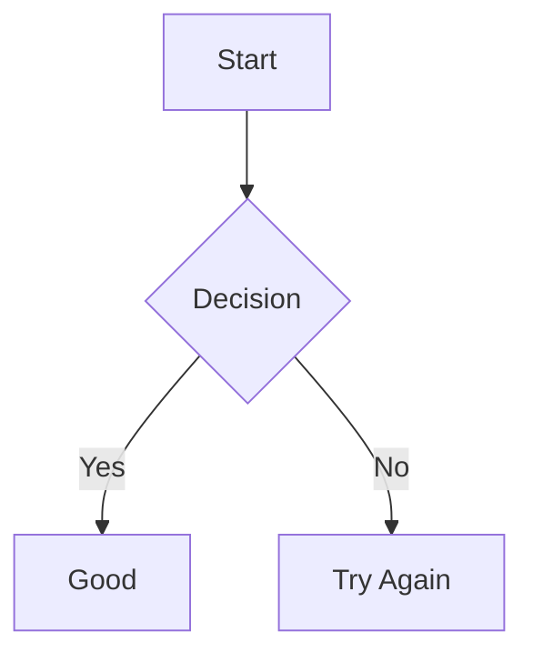

---
{"dg-publish":true,"permalink":"/education/obsidian-tutorial/basic-en/","created":"2025-11-25T18:04:33.314+05:00","updated":"2025-11-25T19:57:38.206+05:00"}
---

# Obsidian Beginner’s Guide (English) – Clean & Visual
> [!warning] Reminder:
> #####  Below syntax examples are given. Some of them should be wrapped with two <b>```</b> backticks when using. They are marked as #InsideTripleBacktics in examples.


---
# 001. Install Obsidian in 1 Minute

1. Go to [obsidian.md](https://obsidian.md)
2. Download the installer for your OS (Windows/Mac/Linux)
3. Run the installer → Follow prompts
4. Launch Obsidian → Done! It's free and open-source.


---
# 002. Switch to Uzbek Language Fast

1. Settings → Appearance → Language
2. Select “Uzbek (Ўзбек)”
3. Restart the app → Everything switches to Uzbek.


---
# 003. Create New Note in One Click

1. Press Ctrl + N → New blank note
2. Or click “+” in the left sidebar
3. Name the file right away (supports Latin or Cyrillic).


---
# 004. Headings with Hash Levels


- [ ] *Syntax*:
```markdown
# H1 Heading (Biggest)
## H2 Heading
### H3 Heading
#### H4 Heading
##### H5 Heading
###### H6 Heading (smallest)
```
- [x] *Result*:

# H1 Heading (Biggest)
## H2 Heading
### H3 Heading
#### H4 Heading
##### H5 Heading
###### H6 Heading (smallest)


---
# 005. How to Make Text Bold in Obsidian


- [ ] *Syntax*:
```markdown
**bold** or __bold__
```
- [x] *Result*: 
**bold** or __bold__


---
# 006. How to Write Italic Text Fast


- [ ] *Syntax*:
```markdown
*italic* or _italic_
```
- [x] *Result*:
*italic* or _italic_


---
# 007. Strikethrough Text Tutorial


- [ ] *Syntax*:
```markdown
~~strikethrough~~
```
- [x] *Result*:
~~strikethrough~~


---
# 008. Highlight Important Text Easily


- [ ] *Syntax*:
```markdown
==highlight==
```
- [x] *Result*:


---
# 009. Toolbar Quick Formatting Tips
Select text → use:
- `Ctrl+B` → **bold**
- `Ctrl+I` → *italic*
- `Ctrl+D` → ~~strikethrough~~
- `Alt+H` → ==highlight==


---
# 010. Horizontal Divider Line in Obsidian


- [ ] *Syntax*:
```markdown
---
***
___
```
- [x] *Result*:
---
***
___


---
# 011. Block Quotes for Better Notes


- [ ] *Syntax*:
```markdown
> Single level quote
>> Nested quote
```
- [x] *Result*:

> Single level quote
>> Nested quote


---
# 012. Bulleted Lists in Obsidian


- [ ] *Syntax*:
```markdown
- Item 1
- Item 2
  - Sub-item
```
- [x] *Result*:
- Item 1
- Item 2
  - Sub-item


---
# 013. Numbered Lists Step by Step


- [ ] *Syntax*:
```markdown
1. First
2. Second
   3. Sub 1
   4. Sub 2
```
- [x] *Result*:
1. First
2. Second
   3. Sub 1
   4. Sub 2


---
# 014. Indent and Outdent Lists
#### `Tab` → indent  
#### `Shift+Tab` → outdent


---
# 015. Task Checkboxes in Obsidian


- [ ] *Syntax*:
```markdown
- [ ] Not done
- [x] Done
- [>] Deferred
- [?] Question
```
- [x] *Result*:

- [ ] Not done
- [x] Done
- [>] Deferred
- [?] Question


---
# 016. Add External Links Correctly


- [ ] *Syntax*:
```markdown
[Obsidian](https://obsidian.md)
```
- [x] *Result*: → [Obsidian](https://obsidian.md)


---
# 017. Simple Internal Links Wiki Style


- [ ] *Syntax*:
```markdown
[[031. Math in Obsidian\|031. Math in Obsidian]]
```
- [x] *Result*: → [[031. Math in Obsidian\|031. Math in Obsidian]]


---
# 018. Aliased Internal Links


- [ ] *Syntax*:
```markdown
[[031. Math in Obsidian\|LaTeX Guide]]
```
- [x] *Result*: → [LaTeX Guide]([[031. Math in Obsidian\|031. Math in Obsidian]])


---
# 019. Link to Headings Inside Note


- [ ] *Syntax*:
```markdown
[[Obsidian Guide#005. How to Make Text Bold in Obsidian\|Bold Text]]
```
- [x] *Result*: → [Bold Text]([[Obsidian Guide#005. How to Make Text Bold in Obsidian\|Obsidian Guide#005. How to Make Text Bold in Obsidian]])


---
# 020. Embed Notes with Exclamation


- [ ] *Syntax*:
```markdown
![[001. Install Obsidian in 1 Minute\|001. Install Obsidian in 1 Minute]]
```
- [x] *Result*: → (embeds the whole note here)

Resize example:  
```markdown
![[photo.jpg\|300]]
```


---
# 021. Code Blocks and Syntax Highlight


- [ ] *Syntax*:
    ```python
    print("Hello Obsidian!")
    ```
- [x] *Result*:  
```python
print("Hello Obsidian!")
```


---
# 022. Create Tables in Obsidian Fast


- [ ] *Syntax*:
```markdown
| Name   | Age | City       |
|:-------|:---:|-----------:|
| Ali    | 25  | Tashkent   |
| Vali   | 30  | Samarkand  |
```
- [x] *Result*:

| Name   | Age | City       |
|:-------|:---:|-----------:|
| Ali    | 25  | Tashkent   |
| Vali   | 30  | Samarkand  |


---
# 023. Assets Folder Setup


- [ ] *Syntax*:
Create folder → `Assets` or `Attachments` → drop all media there.


---
# 024. Embed Audio Files in Notes


- [ ] *Syntax*:
```markdown
![[song.mp3\|song.mp3]]
```
Plays inline.
- [x] *Result*:


---
# 025. Embed Local Video Files Easily


- [ ] *Syntax*:
```markdown
![[video.mp4\|video.mp4]]
```
Plays inside the note.
- [x] *Result*:


---
# 026. Embed PDF Documents in Obsidian


- [ ] *Syntax*:
```markdown
![[paper.pdf\|paper.pdf]]
![[paper.pdf#page=5\|paper.pdf#page=5]]
```
Shows page 5 directly.
- [x] *Result*:


---
# 027. Add and Embed Images Properly


- [ ] *Syntax*:
```markdown
![[photo.jpg\|photo.jpg]]
![[photo.jpg\|400x300]]
![[photo.jpg\|right]]
```
Aligns right with width 250px.
- [x] *Result*:


---
# 028. Embed Maps


- [ ] *Syntax*:
```markdown
![[map-screenshot.jpg\|map-screenshot.jpg]]
```
- [x] *Result*:

or link:  
[Google Maps Location](https://goo.gl/maps/...)
- [x] *Result*:


---
# 029. Callouts for Beautiful Notes


- [ ] *Syntax*:
```markdown
> [!info] Title
> Useful information
```
- [x] *Result*:
> [!info] Title
> Useful information


- [ ] *Syntax*:
```markdown
> [!tip] Quick Tip
> Save time with this!
```
- [x] *Result*:
> [!tip] Quick Tip
> Save time with this!


- [ ] *Syntax*:
```markdown
> [!warning] Careful
> This might break something
```
- [x] *Result*:
> [!warning] Careful
> This might break something

Other types: `note`, `abstract`, `success`, `error`, `example`, `quote`


---
# 030. Flowcharts and Diagrams Fast (Mermaid)
#InsideTripleBacktics 

- [ ] *Syntax*:
``` code
mermaid
graph TD
    A[Start] --> B{Decision}
    B -->|Yes| C[Good]
    B -->|No| D[Try Again]
```
- [x] *Result*:



---
# 031. Math in Obsidian | LaTeX
### Inline:  


- [ ] *Syntax*
`$E = mc^2---
{"dg-publish":true,"permalink":"/education/obsidian-tutorial/basic-en/","created":"2025-11-25T18:04:33.314+05:00","updated":"2025-11-25T19:57:38.206+05:00"}
---

# Obsidian Beginner’s Guide (English) – Clean & Visual
> [!warning] Reminder:
> #####  Below syntax examples are given. Some of them should be wrapped with two <b>```</b> backticks when using. They are marked as #InsideTripleBacktics in examples.


---
# 001. Install Obsidian in 1 Minute

1. Go to [obsidian.md](https://obsidian.md)
2. Download the installer for your OS (Windows/Mac/Linux)
3. Run the installer → Follow prompts
4. Launch Obsidian → Done! It's free and open-source.


---
# 002. Switch to Uzbek Language Fast

1. Settings → Appearance → Language
2. Select “Uzbek (Ўзбек)”
3. Restart the app → Everything switches to Uzbek.


---
# 003. Create New Note in One Click

1. Press Ctrl + N → New blank note
2. Or click “+” in the left sidebar
3. Name the file right away (supports Latin or Cyrillic).


---
# 004. Headings with Hash Levels


- [ ] *Syntax*:
```markdown
# H1 Heading (Biggest)
## H2 Heading
### H3 Heading
#### H4 Heading
##### H5 Heading
###### H6 Heading (smallest)
```
- [x] *Result*:

# H1 Heading (Biggest)
## H2 Heading
### H3 Heading
#### H4 Heading
##### H5 Heading
###### H6 Heading (smallest)


---
# 005. How to Make Text Bold in Obsidian


- [ ] *Syntax*:
```markdown
**bold** or __bold__
```
- [x] *Result*: 
**bold** or __bold__


---
# 006. How to Write Italic Text Fast


- [ ] *Syntax*:
```markdown
*italic* or _italic_
```
- [x] *Result*:
*italic* or _italic_


---
# 007. Strikethrough Text Tutorial


- [ ] *Syntax*:
```markdown
~~strikethrough~~
```
- [x] *Result*:
~~strikethrough~~


---
# 008. Highlight Important Text Easily


- [ ] *Syntax*:
```markdown
==highlight==
```
- [x] *Result*:


---
# 009. Toolbar Quick Formatting Tips
Select text → use:
- `Ctrl+B` → **bold**
- `Ctrl+I` → *italic*
- `Ctrl+D` → ~~strikethrough~~
- `Alt+H` → ==highlight==


---
# 010. Horizontal Divider Line in Obsidian


- [ ] *Syntax*:
```markdown
---
***
___
```
- [x] *Result*:
---
***
___


---
# 011. Block Quotes for Better Notes


- [ ] *Syntax*:
```markdown
> Single level quote
>> Nested quote
```
- [x] *Result*:

> Single level quote
>> Nested quote


---
# 012. Bulleted Lists in Obsidian


- [ ] *Syntax*:
```markdown
- Item 1
- Item 2
  - Sub-item
```
- [x] *Result*:
- Item 1
- Item 2
  - Sub-item


---
# 013. Numbered Lists Step by Step


- [ ] *Syntax*:
```markdown
1. First
2. Second
   3. Sub 1
   4. Sub 2
```
- [x] *Result*:
1. First
2. Second
   3. Sub 1
   4. Sub 2


---
# 014. Indent and Outdent Lists
#### `Tab` → indent  
#### `Shift+Tab` → outdent


---
# 015. Task Checkboxes in Obsidian


- [ ] *Syntax*:
```markdown
- [ ] Not done
- [x] Done
- [>] Deferred
- [?] Question
```
- [x] *Result*:

- [ ] Not done
- [x] Done
- [>] Deferred
- [?] Question


---
# 016. Add External Links Correctly


- [ ] *Syntax*:
```markdown
[Obsidian](https://obsidian.md)
```
- [x] *Result*: → [Obsidian](https://obsidian.md)


---
# 017. Simple Internal Links Wiki Style


- [ ] *Syntax*:
```markdown
[[031. Math in Obsidian]]
```
- [x] *Result*: → [[031. Math in Obsidian]]


---
# 018. Aliased Internal Links


- [ ] *Syntax*:
```markdown
[[031. Math in Obsidian|LaTeX Guide]]
```
- [x] *Result*: → [LaTeX Guide]([[031. Math in Obsidian]])


---
# 019. Link to Headings Inside Note


- [ ] *Syntax*:
```markdown
[[Obsidian Guide#005. How to Make Text Bold in Obsidian|Bold Text]]
```
- [x] *Result*: → [Bold Text]([[Obsidian Guide#005. How to Make Text Bold in Obsidian]])


---
# 020. Embed Notes with Exclamation


- [ ] *Syntax*:
```markdown
![[001. Install Obsidian in 1 Minute]]
```
- [x] *Result*: → (embeds the whole note here)

Resize example:  
```markdown
![[photo.jpg|300]]
```


---
# 021. Code Blocks and Syntax Highlight


- [ ] *Syntax*:
    ```python
    print("Hello Obsidian!")
    ```
- [x] *Result*:  
```python
print("Hello Obsidian!")
```


---
# 022. Create Tables in Obsidian Fast


- [ ] *Syntax*:
```markdown
| Name   | Age | City       |
|:-------|:---:|-----------:|
| Ali    | 25  | Tashkent   |
| Vali   | 30  | Samarkand  |
```
- [x] *Result*:

| Name   | Age | City       |
|:-------|:---:|-----------:|
| Ali    | 25  | Tashkent   |
| Vali   | 30  | Samarkand  |


---
# 023. Assets Folder Setup


- [ ] *Syntax*:
Create folder → `Assets` or `Attachments` → drop all media there.


---
# 024. Embed Audio Files in Notes


- [ ] *Syntax*:
```markdown
![[song.mp3]]
```
Plays inline.
- [x] *Result*:


---
# 025. Embed Local Video Files Easily


- [ ] *Syntax*:
```markdown
![[video.mp4]]
```
Plays inside the note.
- [x] *Result*:


---
# 026. Embed PDF Documents in Obsidian


- [ ] *Syntax*:
```markdown
![[paper.pdf]]
![[paper.pdf#page=5]]
```
Shows page 5 directly.
- [x] *Result*:


---
# 027. Add and Embed Images Properly


- [ ] *Syntax*:
```markdown
![[photo.jpg]]
![[photo.jpg|400x300]]
![[photo.jpg|right|250]]
```
Aligns right with width 250px.
- [x] *Result*:


---
# 028. Embed Maps


- [ ] *Syntax*:
```markdown
![[map-screenshot.jpg]]
```
- [x] *Result*:

or link:  
[Google Maps Location](https://goo.gl/maps/...)
- [x] *Result*:


---
# 029. Callouts for Beautiful Notes


- [ ] *Syntax*:
```markdown
> [!info] Title
> Useful information
```
- [x] *Result*:
> [!info] Title
> Useful information


- [ ] *Syntax*:
```markdown
> [!tip] Quick Tip
> Save time with this!
```
- [x] *Result*:
> [!tip] Quick Tip
> Save time with this!


- [ ] *Syntax*:
```markdown
> [!warning] Careful
> This might break something
```
- [x] *Result*:
> [!warning] Careful
> This might break something

Other types: `note`, `abstract`, `success`, `error`, `example`, `quote`


---
# 030. Flowcharts and Diagrams Fast (Mermaid)
#InsideTripleBacktics 

- [ ] *Syntax*:
``` code
mermaid
graph TD
    A[Start] --> B{Decision}
    B -->|Yes| C[Good]
    B -->|No| D[Try Again]
```
- [x] *Result*:
```mermaid
graph TD
    A[Start] --> B{Decision}
    B -->|Yes| C[Good]
    B -->|No| D[Try Again]

- [x] *Result*:
$E = mc^2$

### Block:  


- [ ] *Syntax*
```markdown
$$
\int_0^\infty e^{-x^2} \, dx = \frac{\sqrt{\pi}}{2}
$$
```
- [x] *Result*:
$$
\int_0^\infty e^{-x^2} \, dx = \frac{\sqrt{\pi}}{2}
$$

## You’ve mastered Obsidian basics!  
Next step: enable Core Plugins → Graph View, Daily Notes, and explore Community Plugins. Happy note-taking! 🚀