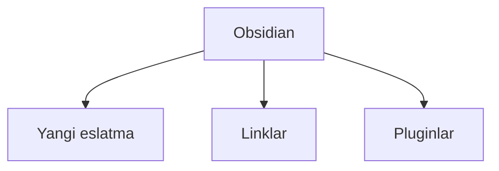

---
{"dg-publish":true,"permalink":"/education/obsidian-tutorial/basic-uz/","noteIcon":"","created":"2025-11-25T18:04:41.755+05:00","updated":"2025-11-25T21:22:03.272+05:00"}
---


# Obsidian — Boshlovchilar uchun qo'llanma (O'zbek tilida)


---
# 001. Yangi hamyon ochish (Yangi Vault yaratish)
1. Obsidian-ni oching  
2. “Create new vault” tugmasini bosing  
3. Vault nomini kiriting (masalan: «Mening Bilimlarim»)  
4. Kompyuteringizda kerakli joyni tanlang → “Create”  
5. Tayyor! Endi bu papka ichidagi barcha .md fayllar Obsidian bilan ochiladi.


---
# 002. O'zbek Tiliga O'tish
- Sozlamalar → Appearance → Language  
- “Uzbek (Ўзбек)” ni tanlang  
- Dasturni qayta ishga tushiring → hammasi o‘zbekcha bo‘ladi.


---
# 003. Yangi Eslatma Yaratish
- Ctrl + N → yangi bo‘sh eslatma  
- Yoki chap paneldagi “+” belgini bosing  
- Fayl nomini darhol lotin yoki kirillda yozishingiz mumkin.


---
# 004. Sarlavhalar Bilan Ishlash
- [ ] *Syntax*:
```markdown

```


---
# 005. Qalin Matn Yozish
- [ ] *Syntax*:
```markdown
**qalin matn** yoki __qalin matn__
→ ko‘rinishi: **qalin matn**
```


---
# 006. Qiya Matn Yozish
- [ ] *Syntax*:
```markdown
* qiya matn * yoki _qiya matn_
→ ko‘rinishi: *qiya matn*
```


---
# 007. Ustiga Chizilgan Matn
- [ ] *Syntax*:
```markdown
~~ustiga chizilgan~~
→ ko‘rinishi: ~~ustiga chizilgan~~
```


---
# 008. Matnni Belgilash (Highlight)
- [ ] *Syntax*:
```markdown
==belgilangan matn==
yoki
`bitta backtick ichida` → bitta backtick ichida
```


---
# 009. Tez Formatlash
Tanlangan matn ustida:
- Ctrl + B → **qalin**
- Ctrl + I → *qiya*
- Ctrl + D → ~~ustiga chizish~~
- Alt + H → ==belgilash==


---
# 010. Gorizontal Chiziq
- [ ] *Syntax*:
```markdown
---
yoki
***
yoki
___
```


---
# 011. Blok Iqtibos Yaratish
- [ ] *Syntax*:
```markdown
> Oddiy iqtibos
> 
> > Ichma-ich iqtibos
```


---
# 012. Tartiblanmagan Ro'yxat
- [ ] *Syntax*:
```markdown
- Birinchi band
- Ikkinchi band
  - Ichki band (2 bo‘sh joy yoki Tab)
```


---
# 013. Tartiblangan Ro'yxat
- [ ] *Syntax*:
```markdown
1. Birinchi
2. Ikkinchi
   3. Ichki 1
   4. Ichki 2
```


---
# 014. Ro'yxat Sathini O'zgartirish
##### - Tab → o‘ngga surish (sathni oshirish)
##### - Shift + Tab → chapga surish (sathni kamaytirish)


---
# 015. Checkbox Vazifalar (Task)
- [ ] *Syntax*:
```markdown
- [ ] Bajarilmagan vazifa
- [x] Bajarilgan vazifa
- [>] Keyinga qoldirilgan
- [?] Savol
```


---
# 016. Tashqi Havola Qo'yish
- [ ] *Syntax*:
```markdown
[Google](https://google.com)
```


---
# 017. Oddiy Ichki Link
- [ ] *Syntax*:
```markdown
[[001. Yangi hamyon ochish]]
```


---
# 018. Nomlangan Ichki Link
- [ ] *Syntax*:
```markdown
[[001. Yangi hamyon ochish|Yangi vault qanday ochiladi?]]
```


---
# 019. Sarlavhaga Link Berish
- [ ] *Syntax*:
```markdown
[[Obsidian qo‘llanma#005. Qalin Matn Yozish|Qalin matn haqida]]
```


---
# 020. Eslatmani Biriktirish (Embed)
- [ ] *Syntax*:
```markdown
![[001. Yangi hamyon ochish]]
yoki kichikroq ko‘rsatish uchun:
![[foto.jpg|300]] ← rasmni 300px ga qisqartiradi
```


---
# 021. Kod Bloklari Yaratish
- [ ] *Syntax*:
```markdown
python
print("Salom dunyo!")
```


```python
print("Salom dunyo!")
```

---
# 022. Jadval Qo'shish
- [ ] *Syntax*:
```markdown
| Ism        | Yosh | Shahar     |
|------------|:----:|-----------|
| Ali        | 25   | Toshkent  |
| Vali       | 30   | Samarqand |
```


---
# 023. Media Uchun Papka Tayyorlash
Vault ichida papka yarating → masalan: `00-Attachments` yoki `Fayllar`  
Keyin media fayllarni shu yerga tashlang.


---
# 024. Musiqa Biriktirish
- [ ] *Syntax*:
```markdown
![[music.mp3]]
yoki to‘g‘ridan hyperlink:
[audio](music.mp3)
```


---
# 025. Video Biriktirish
- [ ] *Syntax*:
```markdown
![[video.mp4]]
yoki YouTube:
![[https://youtu.be/dQw4w9WgXcQ]]
```


---
# 026. PDF Biriktirish
- [ ] *Syntax*:
```markdown
![[kitob.pdf]]
yoki faqat sahifani ko‘rsatish:
![[kitob.pdf#page=15]]
```


---
# 027. Rasm Biriktirish
- [ ] *Syntax*:
```markdown
![[rasm.jpg]]
![[rasm.png|300x400]] ← kenglik va balandlik
![[rasm.webp|right|300]] ← o‘ng tomonda
```


---
# 028. Xarita Biriktirish (Obsidian Maps yoki oddiy)
- [ ] *Syntax*:
```markdown
![[xarita.png]]
yoki onlayn xarita:
[Google Maps](https://maps.app.goo.gl/...)
```


---
# 029. Konvert Bloklari (Callouts)
- [ ] *Syntax*:
```markdown
> [!info] Ma’lumot
> Bu yerda muhim ma’lumotlar

> [!tip] Maslahat
> Foydali maslahat

> [!warning] Ehtiyot bo‘ling
> Xavfli harakat

> [!question] Savol
> Nimani aniqlashtirish kerak?
```

Boshqa turlari: `note`, `abstract`, `success`, `error`, `example`, `quote`


---
# 030. Mermaid Diagrammalar
- [ ] *Syntax*:


Yana misollar: flowchart, sequence, gantt, pie chart va boshqalar.


---
# 031. Matematik Ifodalar | LaTeX
Bir qatorli:
- [ ] *Syntax*:
```markdown
$ E = mc^2 $
```

Blok ichida:
- [ ] *Syntax*:
```markdown
$ \int_0^\infty e^{-x^2} dx = \frac{\sqrt{\pi}}{2} $
```
Ko'rinishi:
$$ \int_0^\infty e^{-x^2} dx = \frac{\sqrt{\pi}}{2} $$


---
# Tabriklaymiz, endi siz Obsidian-ning asosiy funksiyalarini to‘liq bilasiz!  
