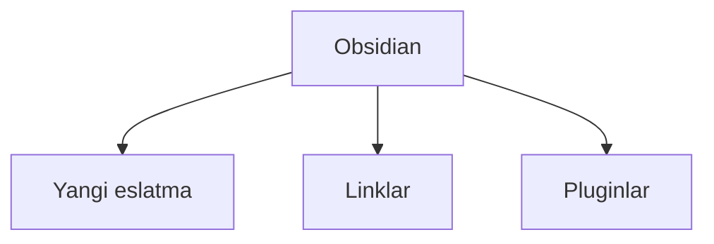

---
{"dg-publish":true,"permalink":"/education/obsidian-tutorial/basic-uz/","title":"Obsidian asoslari","noteIcon":"global/original_logo.svg","created":"2025-11-25T18:04:41.755+05:00","updated":"2025-12-24T17:53:49.938+05:00"}
---


# Obsidian — Boshlovchilar uchun qo'llanma (O'zbek tilida)

# Mundarija

[[EDUCATION/Obsidian tutorial/Basic.uz#001. Yangi hamyon ochish (Yangi Vault yaratish)\|001. Yangi hamyon ochish (Yangi Vault yaratish)]]
[[EDUCATION/Obsidian tutorial/Basic.uz#002. O'zbek Tiliga O'tish\|002. O'zbek Tiliga O'tish]]
[[EDUCATION/Obsidian tutorial/Basic.uz#003. Yangi Eslatma Yaratish\|003. Yangi Eslatma Yaratish]]
[[EDUCATION/Obsidian tutorial/Basic.uz#004. Sarlavhalar Bilan Ishlash\|004. Sarlavhalar Bilan Ishlash]]
[[EDUCATION/Obsidian tutorial/Basic.uz#005. Qalin Matn Yozish\|005. Qalin Matn Yozish]]
[[EDUCATION/Obsidian tutorial/Basic.uz#006. Qiya Matn Yozish\|006. Qiya Matn Yozish]]
[[EDUCATION/Obsidian tutorial/Basic.uz#007. Ustiga Chizilgan Matn\|007. Ustiga Chizilgan Matn]]
[[EDUCATION/Obsidian tutorial/Basic.uz#008. Matnni Belgilash (Highlight)\|008. Matnni Belgilash (Highlight)]]
[[EDUCATION/Obsidian tutorial/Basic.uz#009. Tez Formatlash\|009. Tez Formatlash]]
[[EDUCATION/Obsidian tutorial/Basic.uz#010. Gorizontal Chiziq\|010. Gorizontal Chiziq]]
[[EDUCATION/Obsidian tutorial/Basic.uz#011. Blok Iqtibos Yaratish\|011. Blok Iqtibos Yaratish]]
[[EDUCATION/Obsidian tutorial/Basic.uz#012. Tartiblanmagan Ro'yxat\|012. Tartiblanmagan Ro'yxat]]
[[EDUCATION/Obsidian tutorial/Basic.uz#013. Tartiblangan Ro'yxat\|013. Tartiblangan Ro'yxat]]
[[EDUCATION/Obsidian tutorial/Basic.uz#014. Ro'yxat Sathini O'zgartirish\|014. Ro'yxat Sathini O'zgartirish]]
[[EDUCATION/Obsidian tutorial/Basic.uz#015. Checkbox Vazifalar (Task)\|015. Checkbox Vazifalar (Task)]]
[[EDUCATION/Obsidian tutorial/Basic.uz#016. Tashqi Havola Qo'yish\|016. Tashqi Havola Qo'yish]]
[[EDUCATION/Obsidian tutorial/Basic.uz#017. Oddiy Ichki Link\|017. Oddiy Ichki Link]]
[[EDUCATION/Obsidian tutorial/Basic.uz#018. Nomlangan Ichki Link\|018. Nomlangan Ichki Link]]
[[EDUCATION/Obsidian tutorial/Basic.uz#019. Sarlavhaga Link Berish\|019. Sarlavhaga Link Berish]]
[[EDUCATION/Obsidian tutorial/Basic.uz#020. Eslatmani Biriktirish (Embed)\|020. Eslatmani Biriktirish (Embed)]]
[[EDUCATION/Obsidian tutorial/Basic.uz#021. Kod Bloklari Yaratish\|021. Kod Bloklari Yaratish]]
[[EDUCATION/Obsidian tutorial/Basic.uz#022. Jadval Qo'shish\|022. Jadval Qo'shish]]
[[EDUCATION/Obsidian tutorial/Basic.uz#023. Media Uchun Papka Tayyorlash\|023. Media Uchun Papka Tayyorlash]]
[[EDUCATION/Obsidian tutorial/Basic.uz#024. Musiqa Biriktirish\|024. Musiqa Biriktirish]]
[[EDUCATION/Obsidian tutorial/Basic.uz#025. Video Biriktirish\|025. Video Biriktirish]]
[[EDUCATION/Obsidian tutorial/Basic.uz#026. PDF Biriktirish\|026. PDF Biriktirish]]
[[EDUCATION/Obsidian tutorial/Basic.uz#027. Rasm Biriktirish\|027. Rasm Biriktirish]]
[[EDUCATION/Obsidian tutorial/Basic.uz#028. Xarita Biriktirish (Obsidian Maps yoki oddiy)\|028. Xarita Biriktirish (Obsidian Maps yoki oddiy)]]
[[EDUCATION/Obsidian tutorial/Basic.uz#029. Konvert Bloklari (Callouts)\|029. Konvert Bloklari (Callouts)]]
[[EDUCATION/Obsidian tutorial/Basic.uz#030. Mermaid Diagrammalar\|030. Mermaid Diagrammalar]]
[[EDUCATION/Obsidian tutorial/Basic.uz#031. Matematik Ifodalar (LaTeX)\|031. Matematik Ifodalar ]]

> [!warning] Eslatma:
>
> ##### Quyida sintaksis namunalari berilgan. Foydalanish vaqtida ulardan ba'zilari <b>```</b> (uchtalik tirnoq) bilan o'ralishi kerak. Bu kabilar #UchtalikTirnoqIchida tegi bilan belgilangan.

---

# 001. Yangi hamyon ochish (Yangi Vault yaratish)

###### [[Basic.uz#Mundarija|Mundarija ga o'tish]]

<video autoplay muted controls allowfullscreen preload="none" src="https://raw.githubusercontent.com/fargonee/obsidian_tutorial/main/resources/sounded_videos/001_yangi_hamyon_ochish___62ce7908763d16742d92294e7be78ee2f12e969b388fb78234ec37b148731944.mkv"/>

1. Obsidian-ni oching
2. “Create new vault” tugmasini bosing
3. Vault nomini kiriting (masalan: «Mening Bilimlarim»)
4. Kompyuteringizda kerakli joyni tanlang → “Create”
5. Tayyor! Endi bu papka ichidagi barcha .md fayllar Obsidian bilan ochiladi.

---

# 002. O'zbek Tiliga O'tish

###### [[Basic.uz#Mundarija|Mundarija ga o'tish]]

<video autoplay muted controls allowfullscreen preload="none" src="https://raw.githubusercontent.com/fargonee/obsidian_tutorial/main/resources/sounded_videos/002_ozbek_tiliga_sozlash___8c7e1b6775a0091c31a740e19164f1b20c1abfdc7043b999f82013c5b4220e24.mkv"/>

1. Sozlamalar → Appearance → Language
2. “Uzbek (Ўзбек)” ni tanlang
3. Dasturni qayta ishga tushiring → hammasi o‘zbekcha bo‘ladi.

---

# 003. Yangi Eslatma Yaratish

###### [[Basic.uz#Mundarija|Mundarija ga o'tish]]

<video autoplay muted controls allowfullscreen preload="none" src="https://raw.githubusercontent.com/fargonee/obsidian_tutorial/main/resources/sounded_videos/003_yangi_eslatma_yaratish___10d75ec88b5e8d0ab031016491e24e7b24ab6a4f7dd0d1083027555eed20b4b0.mkv"/>

1. Ctrl + N → yangi bo‘sh eslatma
2. Yoki chap paneldagi “+” belgini bosing
3. Fayl nomini darhol lotin yoki kirillda yozishingiz mumkin.

---

# 004. Sarlavhalar Bilan Ishlash

###### [[Basic.uz#Mundarija|Mundarija ga o'tish]]

<video autoplay muted controls allowfullscreen preload="none" src="https://raw.githubusercontent.com/fargonee/obsidian_tutorial/main/resources/sounded_videos/004_sarvlavhalar___6b3ae0127bf621a3253131631386da3d3083fdbccf295138afa6da87e68850be.mkv"/>

- [ ] _Syntax_:

```markdown
# H1 (Eng katta)

## H2

### H3

#### H4

##### H5

###### H6 (Eng kichik)
```

- [x] _Result_:

# H1 (Eng katta)

## H2

### H3

#### H4

##### H5

###### H6 (Eng kichik)

---

# 005. Qalin Matn Yozish

###### [[Basic.uz#Mundarija|Mundarija ga o'tish]]

<video autoplay muted controls allowfullscreen preload="none" src="https://raw.githubusercontent.com/fargonee/obsidian_tutorial/main/resources/sounded_videos/005_qalin_matn___4f85e0e68709ae50d6b99bed8901ffa783898608792aaa799064c4dd05d0e3e8.mkv"/>

- [ ] _Syntax_:

```markdown
**qalin matn** yoki **qalin matn**
```

- [x] _Result_:
      **qalin matn** yoki **qalin matn**

---

# 006. Qiya Matn Yozish

###### [[Basic.uz#Mundarija|Mundarija ga o'tish]]

<video autoplay muted controls allowfullscreen preload="none" src="https://raw.githubusercontent.com/fargonee/obsidian_tutorial/main/resources/sounded_videos/006_qiya_matn___c7aea5a314c3f6333335afcd1c7fa8192cd2e56d44324f5701ac619b73566330.mkv"/>

- [ ] _Syntax_:

```markdown
_qiya matn_ yoki _qiya matn_
```

- [x] _Result_:
      _qiya matn_ yoki _qiya matn_

---

# 007. Ustiga Chizilgan Matn

###### [[Basic.uz#Mundarija|Mundarija ga o'tish]]

<video autoplay muted controls allowfullscreen preload="none" src="https://raw.githubusercontent.com/fargonee/obsidian_tutorial/main/resources/sounded_videos/007_ustiga_chizilgan_matn___50ddf3f3525f4f668478cccb98663c70d704abada3a290c9779d63e9276d0097.mkv"/>

- [ ] _Syntax_:

```markdown
~~ustiga chizilgan~~
```

- [x] _Result_:
      ~~ustiga chizilgan~~

---

# 008. Matnni Belgilash (Highlight)

###### [[Basic.uz#Mundarija|Mundarija ga o'tish]]

<video autoplay muted controls allowfullscreen preload="none" src="https://raw.githubusercontent.com/fargonee/obsidian_tutorial/main/resources/sounded_videos/008_belgilangan_matn___59e6c2c6175a9f988e27ac14402fa6395aee5b1186c82b73a01074175e0b4354.mkv"/>

- [ ] _Syntax_:

```markdown
==belgilangan matn==
yoki
`bitta backtick ichida`
```

- [x] _Result_:
      ==belgilangan matn==
      yoki
      `bitta backtick ichida`

---

# 009. Tez Formatlash

###### [[Basic.uz#Mundarija|Mundarija ga o'tish]]

<video autoplay muted controls allowfullscreen preload="none" src="https://raw.githubusercontent.com/fargonee/obsidian_tutorial/main/resources/sounded_videos/009_matn_formatlash_oson_usuli___96f954cccab714212d460e16d4115c1dfea57bc62793be471976ceacfad8f8eb.mkv"/>

Tanlangan matn ustida:

- Ctrl + B → **qalin**
- Ctrl + I → _qiya_
- Ctrl + D → ~~ustiga chizish~~
- Alt + H → ==belgilash==

---

# 010. Gorizontal Chiziq

###### [[Basic.uz#Mundarija|Mundarija ga o'tish]]

<video autoplay muted controls allowfullscreen preload="none" src="https://raw.githubusercontent.com/fargonee/obsidian_tutorial/main/resources/sounded_videos/010_gorizontal_chiziq___f6741c79fbcbd0ee61ea5e99e608d5bff534a3fabc38252acf1bbda7947a3b8f.mkv"/>

- [ ] _Syntax_:

```markdown
---

yoki

---

yoki

---
```

- [x] _Result_:

---

yoki

---

yoki

---

---

# 011. Blok Iqtibos Yaratish

###### [[Basic.uz#Mundarija|Mundarija ga o'tish]]

<video autoplay muted controls allowfullscreen preload="none" src="https://raw.githubusercontent.com/fargonee/obsidian_tutorial/main/resources/sounded_videos/011_blokli_iqtibos___74636df7221ba08e3b0303ba85c90a0b88904309b2dd7d8704fc7dd9e8f71a8f.mkv"/>

- [ ] _Syntax_:

```markdown
> Oddiy iqtibos
>
> > Ichma-ich iqtibos
```

- [x] _Result_:
  > Oddiy iqtibos
  >
  > > Ichma-ich iqtibos

---

# 012. Tartiblanmagan Ro'yxat

###### [[Basic.uz#Mundarija|Mundarija ga o'tish]]

<video autoplay muted controls allowfullscreen preload="none" src="https://raw.githubusercontent.com/fargonee/obsidian_tutorial/main/resources/sounded_videos/012_tartiblanMagan_royxat___59b6ace492f886c329f18631fd63c86232100631c736bcf629cfd1f4b6243d1c.mkv"/>

- [ ] _Syntax_:

```markdown
- Birinchi band
- Ikkinchi band
  - Ichki band (2 bo‘sh joy yoki Tab)
```

- [x] _Result_:
- Birinchi band
- Ikkinchi band
  - Ichki band (2 bo‘sh joy yoki Tab)

---

# 013. Tartiblangan Ro'yxat

###### [[Basic.uz#Mundarija|Mundarija ga o'tish]]

<video autoplay muted controls allowfullscreen preload="none" src="https://raw.githubusercontent.com/fargonee/obsidian_tutorial/main/resources/sounded_videos/013_tartiblangan_royxat___dd1479c1b049f341f7b7fe1442bfb8f2daedf2a9e845597f8d991b0047cee4b6.mkv"/>

- [ ] _Syntax_:

```markdown
1. Birinchi
2. Ikkinchi 3. Ichki 1 4. Ichki 2
```

- [x] _Result_:

1. Birinchi
2. Ikkinchi 3. Ichki 1 4. Ichki 2

---

# 014. Ro'yxat Sathini O'zgartirish

###### [[Basic.uz#Mundarija|Mundarija ga o'tish]]

<video autoplay muted controls allowfullscreen preload="none" src="https://raw.githubusercontent.com/fargonee/obsidian_tutorial/main/resources/sounded_videos/014_royxat_elementlari_sathini_ozgartirish___c80be343ae7a2b9257d4a617a3f3960c2f639abf5524ac09a23ea95622f45136.mkv"/>

##### - Tab → o‘ngga surish (sathni oshirish)

##### - Shift + Tab → chapga surish (sathni kamaytirish)

---

# 015. Checkbox Vazifalar (Task)

###### [[Basic.uz#Mundarija|Mundarija ga o'tish]]

<video autoplay muted controls allowfullscreen preload="none" src="https://raw.githubusercontent.com/fargonee/obsidian_tutorial/main/resources/sounded_videos/015_checkbox_lar___1ce21d6e4804d412f0593ecec9c463ea8db4271f3fe42a3c88e7842f51e188e9.mkv"/>

- [ ] _Syntax_:

```markdown
- [ ] Bajarilmagan vazifa
- [x] Bajarilgan vazifa
- [>] Keyinga qoldirilgan
- [?] Savol
```

- [x] _Result_:
- [ ] Bajarilmagan vazifa
- [x] Bajarilgan vazifa
- [>] Keyinga qoldirilgan
- [?] Savol

---

# 016. Tashqi Havola Qo'yish

###### [[Basic.uz#Mundarija|Mundarija ga o'tish]]

<video autoplay muted controls allowfullscreen preload="none" src="https://raw.githubusercontent.com/fargonee/obsidian_tutorial/main/resources/sounded_videos/016_tashqi_linklar___04b42c846cb299bdcb45330d03277d022464e6501b9e7b92ec65678f38c0c279.mkv"/>

- [ ] _Syntax_:

```markdown
[FarGoneE](https://fargonee.github.io)
```

- [x] _Result_:
      [FarGoneE](https://fargonee.github.io)

---

# 017. Oddiy Ichki Link

###### [[Basic.uz#Mundarija|Mundarija ga o'tish]]

<video autoplay muted controls allowfullscreen preload="none" src="https://raw.githubusercontent.com/fargonee/obsidian_tutorial/main/resources/sounded_videos/017_ichki_linklar_oddiy_link___53cbc2f77b6e972c66a2e6fcf71c99f4b45da45d3078d8950af2ec4adfa3d2e4.mkv"/>

- [ ] _Syntax_:

```markdown
[[EDUCATION/Obsidian tutorial/Basic.en\|Basic.en]]
```

- [x] _Result_:
      [[Basic.uz]]

---

# 018. Nomlangan Ichki Link

###### [[Basic.uz#Mundarija|Mundarija ga o'tish]]

<video autoplay muted controls allowfullscreen preload="none" src="https://raw.githubusercontent.com/fargonee/obsidian_tutorial/main/resources/sounded_videos/018_ichki_linklar_nomlangan_link___9a8500bda856cd386e1ed65dff7a87cad5f552dec9989a61715b51357f5528ab.mkv"/>

- [ ] _Syntax_:

```markdown
[[EDUCATION/Obsidian tutorial/Basic.en\|Obsidian asoslari (ingliz)]]
```

- [x] _Result_:
      [[Basic.en|Obsidian asoslari (ingliz)]]

---

# 019. Sarlavhaga Link Berish

###### [[Basic.uz#Mundarija|Mundarija ga o'tish]]

<video autoplay muted controls allowfullscreen preload="none" src="https://raw.githubusercontent.com/fargonee/obsidian_tutorial/main/resources/sounded_videos/019_ichki_linklar_sarvlavha_linklari___b29dcd2cc6051b2b3a43880efe32cd87ae5180b43fafa9154029dfffdb72c4e0.mkv"/>

- [ ] _Syntax_:

```markdown
[[EDUCATION/Obsidian tutorial/Basic.uz#018. Nomlangan Ichki Link\|Oldingi mavzu]]
```

- [x] _Result_:
      [[Basic.uz#018. Nomlangan Ichki Link|Oldingi mavzu]]

---

# 020. Eslatmani Biriktirish (Embed)

###### [[Basic.uz#Mundarija|Mundarija ga o'tish]]

<video autoplay muted controls allowfullscreen preload="none" src="https://raw.githubusercontent.com/fargonee/obsidian_tutorial/main/resources/sounded_videos/020_eslatmalarni_biriktirish___5b3123c4b27659c8f113943a44ff444ebe5fb592c0f7fbd59722fd4d62209a6c.mkv"/>

- [ ] _Syntax_:

```markdown

<div class="transclusion internal-embed is-loaded"><div class="markdown-embed">


Bu eslatma namuna uchun!

</div></div>

```

- [x] _Result_:
      
<div class="transclusion internal-embed is-loaded"><div class="markdown-embed">


Bu eslatma namuna uchun!

</div></div>


---

# 021. Kod Bloklari Yaratish

###### [[Basic.uz#Mundarija|Mundarija ga o'tish]]

<video autoplay muted controls allowfullscreen preload="none" src="https://raw.githubusercontent.com/fargonee/obsidian_tutorial/main/resources/sounded_videos/021_kod_bloklari___40c00d056d3d09fe8023b3022805ac8d753f4f2d61963c5a73e5a9bc5b7d313d.mkv"/>

- [ ] _Syntax_ #InsideTripleBacktics:

```markdown
python
print("Salom dunyo!")
```

- [x] _Result_:

```python
print("Salom dunyo!")
```

---

# 022. Jadval Qo'shish

###### [[Basic.uz#Mundarija|Mundarija ga o'tish]]

<video autoplay muted controls allowfullscreen preload="none" src="https://raw.githubusercontent.com/fargonee/obsidian_tutorial/main/resources/sounded_videos/022_jadvallar___dc1753675e585f73c5f5d59daf1da8bed59349ffc69346f64fffb4e0b29bf3de.mkv"/>

- [ ] _Syntax_:

```markdown
| Ism  | Yosh | Shahar    |
| ---- | :--: | --------- |
| Ali  |  25  | Toshkent  |
| Vali |  30  | Samarqand |
```

- [x] _Result_:

---

# 023. Media Uchun Papka Tayyorlash

###### [[Basic.uz#Mundarija|Mundarija ga o'tish]]

<video autoplay muted controls allowfullscreen preload="none" src="https://raw.githubusercontent.com/fargonee/obsidian_tutorial/main/resources/sounded_videos/023_medialar_resurslarni_tayyorlash___20664f6660c4bb9e14549fb2148d3c16fc998471dd6e5953ae941bc523639981.mkv"/>

1. Vault ichida papka yarating → masalan: `assets` yoki `resurslar`
2. Keyin media fayllarni shu yerga tashlang.

---

# 024. Musiqa Biriktirish

###### [[Basic.uz#Mundarija|Mundarija ga o'tish]]

<video autoplay muted controls allowfullscreen preload="none" src="https://raw.githubusercontent.com/fargonee/obsidian_tutorial/main/resources/sounded_videos/024_medialar_musiqa_biriktirish___ea8edebe9e04e8962aaee78fb48f3508e8e26200cca89526d6234a0e3e366585.mkv"/>

- [ ] _Syntax_:

```markdown
![[music.mp3\|music.mp3]]
yoki to‘g‘ridan hyperlink:
[audio](music.mp3)
```

- [x] _Result_:

---

# 025. Video Biriktirish

###### [[Basic.uz#Mundarija|Mundarija ga o'tish]]

<video autoplay muted controls allowfullscreen preload="none" src="https://raw.githubusercontent.com/fargonee/obsidian_tutorial/main/resources/sounded_videos/025_medialar_video_biriktirish___f6b8172d82dfc1a548473449e545c2da225a8dce5facda49fcad17546a0d0bdf.mkv"/>

- [ ] _Syntax_:

```markdown
![[video.mp4\|video.mp4]]
yoki YouTube:
![[https://youtu.be/dQw4w9WgXcQ\|https://youtu.be/dQw4w9WgXcQ]]
```

- [x] _Result_:

---

# 026. PDF Biriktirish

###### [[Basic.uz#Mundarija|Mundarija ga o'tish]]

<video autoplay muted controls allowfullscreen preload="none" src="https://raw.githubusercontent.com/fargonee/obsidian_tutorial/main/resources/sounded_videos/026_medialar_pdf_biriktirish___f122e6a7ba96faf9c47db147f2334094cb19457b630e61749eec87210645bceb.mkv"/>

- [ ] _Syntax_:

```markdown
![[kitob.pdf\|kitob.pdf]]
yoki faqat sahifani ko‘rsatish:
![[kitob.pdf#page=15\|kitob.pdf#page=15]]
```

- [x] _Result_:

---

# 027. Rasm Biriktirish

###### [[Basic.uz#Mundarija|Mundarija ga o'tish]]

<video autoplay muted controls allowfullscreen preload="none" src="https://raw.githubusercontent.com/fargonee/obsidian_tutorial/main/resources/sounded_videos/027_medialar_rasm_biriktirish___616f562592a6d637b9794cf390021eb2e54fdbc1b6ecbd14920023cdee6ed833.mkv"/>

- [ ] _Syntax_:

```markdown
![[rasm.jpg\|rasm.jpg]]
![[rasm.png\|300x400]] ← kenglik va balandlik
![[rasm.webp\|right]] ← o‘ng tomonda
```

- [x] _Result_:

---

# 028. Xarita Biriktirish (Obsidian Maps yoki oddiy)

###### [[Basic.uz#Mundarija|Mundarija ga o'tish]]

<video autoplay muted controls allowfullscreen preload="none" src="https://raw.githubusercontent.com/fargonee/obsidian_tutorial/main/resources/sounded_videos/028_medialar_xarita_biriktirish___57b64848cda9d0d17d4d4cb31797a98b4fedc98a5fdad77b4651ea94049dafbb.mkv"/>

- [ ] _Syntax_:

```markdown
![[xarita.png\|xarita.png]]
yoki onlayn xarita:
[Google Maps](https://maps.app.goo.gl/...)
```

- [x] _Result_:

---

# 029. Konvert Bloklari (Callouts)

###### [[Basic.uz#Mundarija|Mundarija ga o'tish]]

<video autoplay muted controls allowfullscreen preload="none" src="https://raw.githubusercontent.com/fargonee/obsidian_tutorial/main/resources/sounded_videos/029_konvertlar___ec0e09799ef10b63c6c09c7e991f55e8c8a88b0f6ba90b52e18055788669fc10.mkv"/>

- [ ] _Syntax_:

```markdown
> [!info] Ma’lumot
> Bu yerda muhim ma’lumotlar

> [!tip] Maslahat
> Foydali maslahat

> [!warning] Ehtiyot bo‘ling
> Xavfli harakat

> [!question] Savol
> Nimani aniqlashtirish kerak?
```

Boshqa turlari: `note`, `abstract`, `success`, `error`, `example`, `quote`

- [x] _Result_:

---

# 030. Mermaid Diagrammalar

###### [[Basic.uz#Mundarija|Mundarija ga o'tish]]

<video autoplay muted controls allowfullscreen preload="none" src="https://raw.githubusercontent.com/fargonee/obsidian_tutorial/main/resources/sounded_videos/030_mermaid_diagrammalar___c4bcdc05bf8495846e68c993670178ae75152220d42a5d3382dfbf4b464a7b7e.mkv"/>

- [ ] _Syntax_ #InsideTripleBacktics:

```markdown
mermaid
graph TD
A[Obsidian] --> B[Yangi eslatma]
A --> C[Linklar]
A --> D[Pluginlar]
```

- [x] _Result_:



---

# 031. Matematik Ifodalar (LaTeX)

###### [[Basic.uz#Mundarija|Mundarija ga o'tish]]

<video autoplay muted controls allowfullscreen preload="none" src="https://raw.githubusercontent.com/fargonee/obsidian_tutorial/main/resources/sounded_videos/031_matematik_ifodalar_LaTeX_formati___40cb5637cc2248790aa2eae1a58306aecc74eab56f566cf5f4337187ca64198e.mkv"/>

#### Bir qatorli:

- [ ] _Syntax_:

```markdown
$E = mc^2$
```

- [x] _Result_:
      $E = mc^2$

#### Blok ichida:

- [ ] _Syntax_:

```markdown
$$ \int_0^\infty e^{-x^2} dx = \frac{\sqrt{\pi}}{2} $$
```

- [x] _Result_:
      $$ \int_0^\infty e^{-x^2} dx = \frac{\sqrt{\pi}}{2} $$

---

# Tabriklaymiz, endi siz Obsidian-ning asosiy funksiyalarini to‘liq bilasiz!
