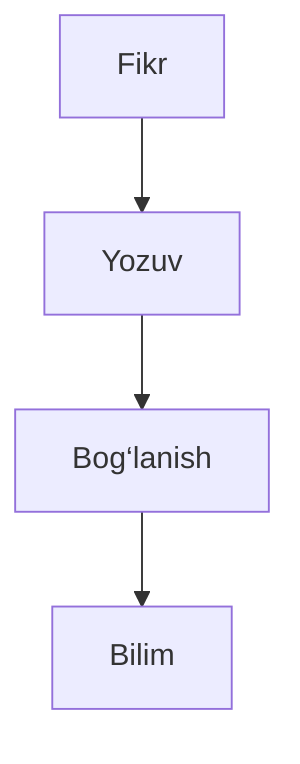

---
{"dg-publish":true,"permalink":"/education/obsidian-tutorial/overview-uz/","title":"Obsidian darslari","noteIcon":"global/original_logo.svg","created":"2025-11-22T00:58:32.361+05:00","updated":"2025-12-30T02:45:57.929+05:00"}
---


# Agar yozmasangiz, yo‘qoladi.

> Fikr yozilmasa — vaqt uni yutadi.  
> Yozilgan fikr esa **qaytib ishlaydi**.

---

## Bu oddiy daftar emas

| Siz odatda qilasiz | Bu yerda esa |
|-------------------|--------------|
| Yozasiz va unutib qo‘yasiz | Yozasiz va qaytasiz |
| Fayllar yo‘qoladi | Tuzilma saqlanadi |
| Bilim parchalanadi | Bilim bog‘lanadi |

Bu farq mayda emas.  
Bu yillar farqi.

---

## Bitta yozuv. Ikki hayot.

```txt
Bugun: shaxsiy fikr
Ertaga: ochiq sahifa
````

Bir marta yoziladi.  
Kerak bo‘lsa — ko‘rsatiladi.

---

## Fikrlar grafikda yashaydi



Bu chizma emas.  
Bu sizning kelajakdagi o‘zingiz.

---

## Minimalizm — bu hashamat

> Kam interfeys  
> Ko‘p aniqlik  
> Nol chalg‘itish

Agar yozuv vositasi sizdan e’tibor so‘rasa — u yutqazgan.

---

## Matematik haqiqat

$$  
Bilim = \sum (yozilgan\ fikrlar \times vaqt)  
$$

Yozilmagan fikrning qiymati **0**.

---

## Oxiri yo‘q joydan boshlanadi

Agar siz:

- fikringizni saqlamoqchi bo‘lsangiz
    
- bilimni ko‘rsatmoqchi bo‘lsangiz
    
- va bir kun “nega oldin boshlamaganman” demoqchi bo‘lmasangiz
    

unda kechiktirmaysiz.

> Yozishni bugun boshlamaganlar  
> ertaga boshqalarning yozganini o‘qiydi.

```

Bu matn yumshoq emas.  
Lekin rost.
```