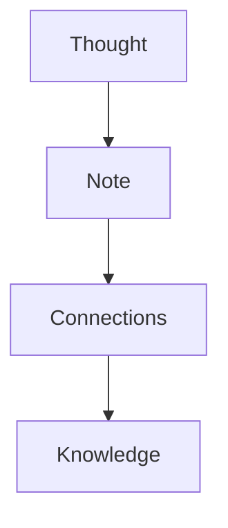

---
{"dg-publish":true,"permalink":"/welcome-to-obsidian/","title":"Welcome to obsidian","noteIcon":"global/original_logo.svg","created":"2025-12-26T19:57:03.877+05:00","updated":"2025-12-26T19:58:37.737+05:00"}
---


# If you don’t write it down, it disappears.

> A thought not written is eaten by time.  
> A written thought **keeps working for you**.

---

## This is not a simple notebook

| What usually happens | What happens here |
|----------------------|-------------------|
| You write and forget | You write and return |
| Files get lost | Structure survives |
| Knowledge fragments | Knowledge connects |

This difference is not small.  
It is measured in years.

---

## One note. Two lives.

```txt
Today: a private thought
Tomorrow: a public page
````

Written once.  
Shown when needed.

---

## Thoughts live as a graph



This is not a diagram.  
This is your future self.

---

## Minimalism is a luxury

> Less interface  
> More clarity  
> Zero distraction

If a writing tool asks for your attention, it already failed.

---

## A mathematical truth

$$  
Knowledge = \sum (written\ thoughts \times time)  
$$

An unwritten thought has a value of **0**.

---

## The future starts where you stop postponing

If you:

- care about preserving your thinking
    
- want your knowledge to be visible
    
- and do not want to say “I should’ve started earlier”
    

then you do not delay.

> Those who don’t write today  
> read what others wrote tomorrow.

```

Uncomfortable.  
Accurate.
```